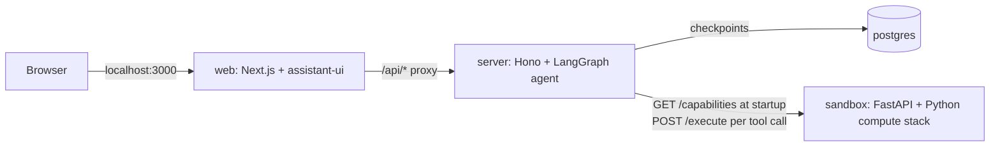

# AI that writes and runs its own Python

A chat app running on a local Kubernetes cluster (kind) where an LLM
agent solves maths word problems by writing a complete Python program
and running it in a separate sandbox service, then answers from the
program's real output. It runs without any API key by default, using
a deterministic stand-in model.

## What you will see

Paste a word problem — the café problem below is the one the
deterministic model is built around — and the assistant:

1. Calls a `code_executor` tool. A card appears showing the generated
   code, its stdout, and the parsed `result.json`.
2. Answers with four sections: `### Model`, `### Solver`,
   `### Solution` (a table), `### Verification`. In scripted mode the
   answer is built from the real tool result; in live mode the model is
   instructed to take every number from the tool results.
3. Keeps the conversation if you reload the page: the chat is rebuilt
   from the conversation's Postgres checkpoint, code executor card and
   all.

## Architecture



- **web** — Next.js + [assistant-ui](https://www.assistant-ui.com/): renders the chat and
  streams the agent's response. Serves port 3000
  (`lab-ai-code-sandbox/web:local`). It proxies every `/api/*` request
  to the server, building the upstream URL from the path and query
  only — the destination host always comes from `SERVER_URL` — and
  streaming the request body straight through. It logs only the
  method, path and response status, never the query string or the
  body.
- **server** — Hono + a LangGraph agent: runs the model loop, streams
  its output, and calls the sandbox for every calculation. Serves port
  8080 (`lab-ai-code-sandbox/server:local`).
- **postgres** — stores each conversation's checkpoints so history
  survives a restart. Port 5432 (`postgres:18.6-bookworm`).
- **sandbox** — FastAPI service with a Python compute stack
  (numpy, pandas, scipy, sympy, scikit-learn): runs the model-generated
  program in its own subprocess and returns its result. Port 8000
  (`lab-ai-code-sandbox/sandbox:local`). The server calls
  `GET /capabilities` once at startup to learn what the sandbox can do,
  and `POST /execute` once per tool call.

## Prerequisites (tested)

- macOS on Apple silicon, with Docker Desktop (engine 28.3.2,
  ≥ 8 GiB memory allotted to Docker)
- [kind](https://kind.sigs.k8s.io/) v0.32.0 — the kind node image is
  pinned by digest in `kind/cluster.yaml`
- kubectl v1.36.3
- GNU make
- Node.js ≥ 24 — only needed for `make e2e` / `make e2e-live`
- openssl, curl

Playwright downloads its own Chromium build the first time you run
`make e2e`, if one isn't already cached.

## Quick start

```bash
make up          # cluster, images, secrets, deploy, port-forward
open http://localhost:3000
```

Paste this into the chat:

> A café sells coffee, tea and sandwiches. Anna pays €13 for 2 coffees,
> 1 tea and 1 sandwich. Ben pays €19 for 1 coffee, 3 teas and 2
> sandwiches. Cleo pays €18 for 3 coffees, 2 teas and 1 sandwich. What
> does each item cost?

By default the server runs in **scripted mode**: a deterministic
stand-in model that always solves the café problem the same way and
builds its answer from the sandbox's real output, so you can see the
whole loop without an API key.

A few things worth knowing:

- `make up` and `make down` never change your current kubectl context.
  Every command in this lab targets `kind-ai-code-sandbox` explicitly,
  and the current context is saved and restored around cluster
  creation and deletion, even if a step fails partway through.
- `make deploy` restarts the pods, which breaks any port-forward you
  already had open. Run `make forward` (or `make up`) again afterwards.
  `make e2e` opens its own forwards on ports 13000 and 18000, so it is
  unaffected either way.
- On a cold first deploy the server pod may restart once while
  Postgres finishes pulling its image — the rollout waits in the
  Makefile cover this, so `make up` still finishes cleanly.

## Using Claude instead

```bash
export ANTHROPIC_API_KEY=sk-ant-...
LLM_MODE=live make up
# or, if the cluster is already up:
make secrets deploy forward LLM_MODE=live
```

The key is read from your shell and stored only as a Kubernetes
Secret — it is never written to a file. `ANTHROPIC_MODEL` defaults to
`claude-sonnet-5`; edit `deploy/server.yaml` to use a different model.
Switching `LLM_MODE` restarts every deployment, which drops any
open port-forward — that's why `forward` is chained onto the command
above. Running `make deploy forward` afterwards puts the server back
into scripted mode and reopens the app.

The live-model test suite (`make e2e-live`) type-checks and lints but
has not yet been run against the real model; the keyless `make e2e`,
covered below, is the verified gate.

## How it works

**Streaming the agent to the UI.** The server turns the LangGraph
agent's stream into an AI SDK UI message stream and hands it straight
back as the HTTP response (`server/src/chat/chat-routes.ts`):

```ts
const stream = await agent.stream(
  { messages: [new HumanMessage(text)] },
  { configurable: { thread_id: threadId }, streamMode: ["values", "messages"] },
);
return createUIMessageStreamResponse({ stream: toUIMessageStream(stream) });
```

On the client, `useChatRuntime` and `AssistantChatTransport` point at
that endpoint and carry the thread id on every request
(`web/src/components/chat-runtime.tsx`):

```tsx
const transport = new AssistantChatTransport({ api: "/api/chat", body: { threadId } });
const runtime = useChatRuntime({ id: threadId, messages: initialMessages, transport });
```

In scripted mode the stand-in model's text is streamed back in
line-sized pieces, the same way a real model's tokens arrive, so the
UI code doesn't need to know which model produced the answer.

**The web proxy.** The web app forwards every `/api/*` request to the
server (`web/src/lib/server-proxy.ts`). It builds the upstream URL
from the path and query only — the destination host always comes from
`SERVER_URL` — and streams the request body straight through, since
`POST /api/chat` needs it. It logs only the method, path and response
status, so chat text never ends up in the web app's logs.

**Reloading chats.** History isn't stored as UI messages — it's
rebuilt on demand from the LangGraph checkpoint (`PostgresSaver`) via
`agent.graph.getState`, then converted with `toUIMessages`. A test
(`server/src/chat/stream-history-parity.test.ts`) runs the scripted
model with a stub tool and an in-memory `MemorySaver`, and shows the
rebuilt assistant message matches the streamed one on its text and
tool parts.

**Interrupted turns.** A chat turn runs only as long as its request
stays open. Reloading the page, starting a new chat or closing the tab
while `code_executor` is still running stops the turn before the
sandbox's answer is saved, so that turn's code card stays unfinished in
the history. The checkpoint then holds a tool call with no answer,
which the Anthropic API would reject on the next turn. Before every
model call, `server/src/agent/interrupted-tool-calls-middleware.ts`
adds a tool message saying that run was interrupted, straight after the
unanswered call. It changes only the request sent to the model, never
the stored history, and the conversation keeps working.

**A tool description the model can trust.** The `code_executor` tool
description isn't hand-written — it's generated from the sandbox's own
`GET /capabilities` response when the server starts
(`server/src/sandbox/tool-description.ts`), so every limit and module
the model is told about is true of the image that will actually run
its code. The real, currently-running description
(`curl -s localhost:3000/api/tools`):

```
Runs a complete Python program in an isolated sandbox and returns its status, exit code, stdout, stderr and an optional structured result.
Use for: every calculation — arithmetic, solving equations or linear systems, optimisation, fitting, statistics, symbolic maths and checking a proposed answer.
Do NOT use for: fetching data from the internet, installing packages, keeping state between calls, or work that needs longer than the timeout.
Environment: Python 3.12.14, standard library plus the modules below.
Installed modules: numpy (numpy 2.5.3), pandas (pandas 3.0.5), scipy (scipy 1.18.1), sympy (sympy 1.14.0), sklearn (scikit-learn 1.9.1).
Limits: wall-clock timeout 30 s; stdout truncated after 65536 bytes and stderr after 65536 bytes; code at most 65536 bytes; result.json at most 65536 bytes; at most 20 executions run at once.
No network use is expected: do not download data, install packages or call external services.
Every execution starts a fresh interpreter in a fresh, empty working directory; no files, variables or imports survive between executions.
To return structured data, write one JSON document to result.json in the working directory (at most 65536 bytes); it comes back parsed as `result`, or `resultError` explains why it was rejected.
Response: JSON with status (succeeded | failed | timed_out), exitCode, stdout, stderr, result (parsed result.json or null), resultError, durationMs and truncated. If the sandbox is busy or unreachable you get {error, message}: retry once, then tell the user.
```

**The system prompt** is rebuilt on every model turn, not baked in
once at startup, so it always carries today's date instead of the
model's training cutoff. `dynamicSystemPromptMiddleware` in
`server/src/agent/build-agent.ts` asks for a fresh prompt before each
model call; `server/src/agent/system-prompt.ts` only builds the text.

**The synchronous execute endpoint.** `POST /execute` does not queue
or hand back a job id — it awaits the whole run and returns the result
on the same HTTP connection
(`sandbox/src/app/execution/runner.py`, `sandbox/src/app/api/app_factory.py`):

```python
process = await asyncio.create_subprocess_exec(
    sys.executable, "-I", "-u", "main.py",
    cwd=workdir, env=_minimal_env(workdir), start_new_session=True,
    stdin=asyncio.subprocess.DEVNULL, stdout=asyncio.subprocess.PIPE, stderr=asyncio.subprocess.PIPE,
)
```

Each run gets a fresh working directory inside a runs directory with
listing turned off (not a security boundary, see below), and a minimal
environment (no inherited variables). Output is captured through bounded pipes so a runaway
print can't exhaust memory, and a timeout kills the whole process
group (`os.killpg`) rather than just the Python process. The
structured result travels back as `result.json` in that same
directory. A single uvicorn worker serves every concurrent request;
oversized code is rejected up front with a 400, and a request that
arrives while all `MAX_CONCURRENT_EXECUTIONS` slots are busy gets a
429 immediately instead of queuing. Because the answer always comes back
on the request that asked for it, there is no execution store, no ids,
no polling, and no TTL to manage — the tradeoff is that the caller
(the server, then the browser) has to stay connected for as long as
the code runs, up to the timeout.

**Step logging.** Every model turn and every tool call is logged as it
starts, succeeds or fails, as one JSON line each
(`server/src/agent/step-logging-middleware.ts`). `make logs` shows the
last 100 lines from the server and sandbox and the last 50 from web.

## Verify it yourself

```bash
make e2e
```

Runs seven scripted (keyless) test files against the running cluster:

- **agent loop** — sends the café problem through the real chat API and
  checks the `code_executor` call, its succeeded result, and the
  four-section answer.
- **browser** — drives the actual UI in headless Chromium: the code
  executor card, the answer table, a reload that restores both, and
  starting a new chat.
- **sandbox API** — the HTTP contract itself: exact module versions,
  an exact stdout/result for a linear system, failures with a
  traceback, a timeout that leaves no process behind, output
  truncation, an unparsable `result.json`, malformed requests, and a
  429 when every execution slot is busy.
- **isolation** — runs 20 executions at once and checks each response
  carries only its own canary, output and `result.json`, and that a
  plain `os.listdir("..")` of the shared runs directory is denied.
- **persistence** — restarts the server pod and checks a thread's
  history comes back identical, and that a second thread never leaks
  into the first.
- **network policy** — proves sandbox pods cannot reach Postgres by IP
  or resolve its hostname, while the server still can.
- **tool description** — checks the generated `code_executor`
  description names exactly the modules and limits the sandbox
  reports, so a drifted limit fails the suite.

On a MacBook with Apple silicon, all 21 tests across those 7 files
pass in about 62 seconds. The JSON report lands at
`e2e/reports/e2e-report.json`; a full-page screenshot of the finished
answer is saved to `e2e/reports/browser-scripted-answer.png`.

```bash
make e2e-live
```

Runs the same shape of checks against the real Anthropic model instead
of the stand-in: the café problem, a different problem (a least-squares
fit, to check the model actually chooses a fitting solver rather than
reciting a memorized answer), and the browser flow. It needs
`ANTHROPIC_API_KEY` in your shell, and first redeploys all three
services (sandbox, server and web) in live mode — which breaks any
open port-forward — then leaves live mode on afterwards. Run
`make deploy forward` to switch back to scripted mode and reopen the
app.

## Limits and defaults

| Limit | Default | Env var |
|---|---|---|
| Execution wall-clock timeout | 30 s | `EXECUTION_TIMEOUT_SECONDS` |
| Server → sandbox client timeout | 45 s (must exceed the execution timeout) | `SANDBOX_CLIENT_TIMEOUT_MS` |
| Max code size | 64 KiB | `MAX_CODE_BYTES` |
| Max stdout / stderr size (each) | 64 KiB | `MAX_OUTPUT_BYTES` |
| Max `result.json` size | 64 KiB | `MAX_RESULT_BYTES` |
| Concurrent executions | 20 | `MAX_CONCURRENT_EXECUTIONS` |
| Sandbox pod CPU limit | 2 cores | (`deploy/sandbox.yaml`) |
| Sandbox pod memory limit | 1 GiB | (`deploy/sandbox.yaml`) |
| Sandbox `/work` volume | 512 Mi | (`deploy/sandbox.yaml`) |

Past the concurrency limit, a request gets an immediate `429` instead
of waiting. A `result.json` that parses but is nested too deeply to
serialize into the HTTP response comes back as a `resultError`, never
as a crash.

## What this sandbox does NOT protect against

This is a teaching sandbox, not a hostile-code isolation system. Read
this section before pointing it at code you don't trust:

- **Shared UID and container.** Every execution runs as the same user
  inside the same container. A running program can see other
  concurrently-running executions through `/proc/<pid>/cwd` and could
  read their working files while they run. Results still only ever
  travel back on the request that submitted them. The shared runs
  directory that holds every execution's own directory has mode
  `0o300` (write+execute only), which keeps a casual `os.listdir("..")`
  from listing other runs' directories — but it is not a boundary
  against code that tries: submitted code runs as the UID that owns
  that directory, so it can `os.chmod("..", 0o700)` and list it, and
  `/proc/<pid>/cwd` finds other runs without listing anything. A
  hostile program can also exhaust CPU, memory or disk for every other
  run in the pod, or start a process that escapes its process group
  (`os.setsid`) and outlives the timeout.
- **The pod's shared process namespace.** The sandbox pod runs with
  `shareProcessNamespace: true` so that the pod's `pause` process (PID
  1) reaps children orphaned when a timed-out program's process group
  is killed — without it, they would pile up as zombies. Checked on
  the running pod: `pause` runs as the same UID (10001) as submitted
  code, submitted code can see it and send it signals, and killing it
  restarts the pod. Its `/proc/1/root` and `/proc/1/environ` are
  readable but hold nothing sensitive. The sandbox app is no longer PID
  1 either — code can still signal it through its parent PID, the same
  as before. This is the same denial-of-service class that already
  existed when the sandbox app itself was PID 1, not a new hole; the
  alternative (a small init such as `tini` baked into the image) was
  traded off to keep the image free of extra packages.
- **A trusted `Content-Length`.** The pre-check that rejects an
  oversized request trusts the declared `Content-Length` header. A
  chunked request body with no such header is read in full before the
  code-size check can reject it.
- **Egress is denied, and it's enforced.** A `NetworkPolicy` blocks all
  outbound traffic from sandbox pods, DNS included. On kind this is
  actually enforced (kind has shipped `kube-network-policies` since
  v0.24), and the `network-policy` e2e test proves it: sandbox code
  cannot reach Postgres by IP or resolve its hostname, while the server
  still can.
- **Kernel exploits and container escapes are out of scope**, as is
  any form of authentication or multi-user separation — this is a
  single-user, no-auth demo. For code you don't trust, look at gVisor-
  style container runtimes, or at a design that runs each execution in
  its own disposable Kubernetes Job (see the Kubernetes Job isolation
  lab in this collection).

## Project layout and conventions

```
lab-ai-code-sandbox-kind/
  Makefile          every command in this README
  kind/             kind cluster config
  deploy/           Kubernetes manifests (applied with kustomize)
  server/           Hono + LangGraph agent (TypeScript)
  web/              Next.js + assistant-ui chat UI (TypeScript)
  sandbox/          FastAPI execution service (Python)
  e2e/              end-to-end test harness (TypeScript, Playwright + vitest)
```

Per-service checks:

- `server/`, `web/`, `e2e/`: `npm test`, `npm run typecheck`,
  `npm run lint`, `npm run knip` (`web/` also has `npm run build`).
- `sandbox/`: `uv run pytest`, `uv run ruff check`,
  `uv run ruff format --check`, `uv run mypy`, `uv run deptry src`
  (tested with uv 0.12.13, matching the version baked into the
  sandbox's own base image).

A few deliberate deviations from how the rest of this lab collection
is usually built:

- Node.js 24 is used instead of the collection's usual Node 22.
- Each service (`server/`, `web/`, `sandbox/`) has its own `Dockerfile`
  in its own directory — three independent build contexts, wired
  together by `make build` and `make load` rather than a compose file.
- The sandbox has no `output.py`: it's an HTTP service, so its only
  output is JSON logs, not files.
- The server's sandbox client and the `code_executor` tool
  deliberately return a failed sandbox call to the model as structured
  content (`sandbox_busy`, `sandbox_unreachable`,
  `sandbox_rejected_code`) instead of throwing, so one failed run
  doesn't end the whole conversation. Everywhere else in this lab,
  errors are logged and re-thrown.
- `e2e/` is a test harness, not an application: it has no logger of
  its own, and failures surface through the vitest reporters and the
  JSON report instead.

## Clean up

```bash
make down
```

Stops the port-forward and deletes only the `ai-code-sandbox` kind
cluster — nothing else on your machine is touched.
