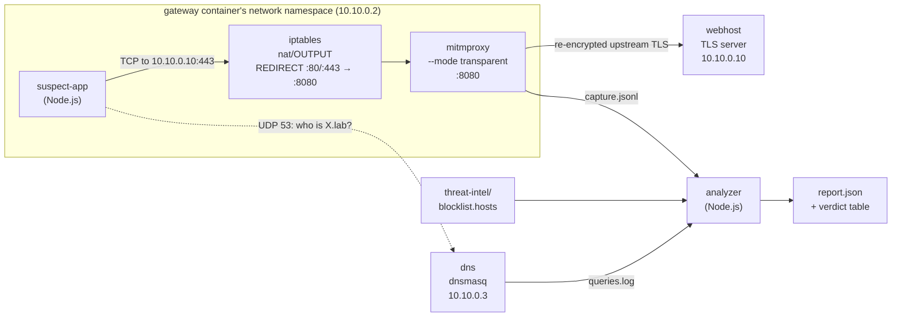

# Is that app you just installed phoning home?

You download a free tool and it works. But what is it talking to in the
background? This lab builds an egress-inspection gateway from OSS parts —
**mitmproxy** in transparent mode plus a DNS-logging **dnsmasq** resolver — and
forces a "freshly downloaded app" through it *without configuring the app*.
Then it reads back exactly what the app leaked, and where the visibility ends.

Everything runs locally in Docker. Nothing touches the real internet, and the
only "secret" the app exfiltrates is an obviously-fake canary.

Companion post: [Is That App You Just Installed Phoning Home? Build a mitmproxy egress gateway that finds out](https://techwithugur.dev/posts/app-egress-audit/).

## Contents
- [Prerequisites](#prerequisites)
- [Run it](#run-it)
- [What you should see](#what-you-should-see)
- [The big picture](#the-big-picture)
- [Component by component](#component-by-component)
  - [The network: `labnet`, `ipam`, and the CIDR](#the-network-labnet-ipam-and-the-cidr)
  - [`dns` — dnsmasq, the DNS visibility layer](#dns--dnsmasq-the-dns-visibility-layer)
  - [`webhost` — the vendor and the attacker, on one box](#webhost--the-vendor-and-the-attacker-on-one-box)
  - [`gateway` — iptables + mitmproxy](#gateway--iptables--mitmproxy)
  - [`suspect-app` — what it does and where it misbehaves](#suspect-app--what-it-does-and-where-it-misbehaves)
  - [`threat-intel/blocklist.hosts` — the verdict source](#threat-intelblocklisthosts--the-verdict-source)
  - [`analyzer` — turning evidence into verdicts](#analyzer--turning-evidence-into-verdicts)
- [The life of one request](#the-life-of-one-request)
- [How we catch malicious activity](#how-we-catch-malicious-activity)
- [Things to try](#things-to-try)
- [SAFETY](#safety)
- [Clean up](#clean-up)

## Prerequisites
- Docker with Compose v2 (`docker compose version`)
- `bash` (for the `./e2e.sh` gate)

## Run it
```bash
docker compose up --build --abort-on-container-exit --exit-code-from analyzer
```
Or run the asserting end-to-end gate, which also verifies the findings and
tears everything down:
```bash
./e2e.sh
```

## What you should see
The analyzer prints a per-domain verdict table and writes `/out/report.json`
(bind-mounted to `tmp/report/report.json` on your host):

| FQDN | Verdict | Evidence layer | What it means |
|------|---------|----------------|----------------|
| `updates.goodvendor.lab` | clean | decrypted HTTP | the legit update check — visible and benign |
| `cdn-metrics.tracklab.lab` | malicious | decrypted HTTP | covert beacon, host fingerprint captured in full |
| `telemetry.adnexus.lab` | malicious | decrypted HTTP | second covert beacon, same fingerprint payload |
| `pin.evil-c2.lab` | malicious | SNI-only (opaque) | certificate-pinned — we see *where*, not *what* |

The two beacons carry the canary `FAKE-FP-000-lab-only`; the pinned connection
refuses the gateway's certificate, so its payload stays hidden — but the
destination is still a finding.

### Where the run's output lands

The lab runs and tears down in seconds, so each container writes its output to
this lab's gitignored `tmp/` directory (host bind mounts) where you can read it
after everything stops:

| Path on your host | What it is |
|---|---|
| `tmp/capture/capture.jsonl` | every SNI, decrypted request and TLS failure the gateway captured — the evidence the analyzer folds into verdicts |
| `tmp/dnslog/queries.log` | every DNS query the app made (the DNS visibility layer) |
| `tmp/report/report.json` | the analyzer's structured verdict report |
| `tmp/certs/` | the gateway's CA and the vendor certificate the `webhost` generated at startup |

`./e2e.sh` starts each run from an empty `tmp/`; a plain `docker compose up`
overwrites the previous run's files in place. Nothing here is committed — `tmp/`
is gitignored.

## The big picture

Five containers on one private Docker network. The suspect app has no idea a
proxy exists: it is placed *inside the gateway's network namespace*, so every
packet it emits is the gateway's packet, and the gateway's firewall rules
quietly divert ports 80/443 into mitmproxy before they leave the box.



Three kinds of evidence come out of this, each from a different vantage point:

| Layer | Produced by | What it tells you | What it can't |
|-------|-------------|-------------------|---------------|
| **DNS** | dnsmasq `log-queries` | every hostname the app *looked up* | whether it connected, or what it sent |
| **TLS SNI** | mitmproxy `tls_clienthello` hook | every hostname the app *opened a TLS connection to*, even ones it later refused | the request contents |
| **Decrypted HTTP** | mitmproxy `request` hook | method, path, headers, full body | nothing — but only works where the app trusts the gateway CA |

The analyzer joins all three by hostname and checks each hostname against a
threat-intel blocklist. Every service below exists to produce one of these
three layers, to consume them, or to give the app somewhere to talk to.

## Component by component

### The network: `labnet`, `ipam`, and the CIDR

```yaml
networks:
  labnet:
    internal: true
    ipam:
      config:
        - subnet: 10.10.0.0/24
```

**Why a custom network at all?** Compose would give us a default bridge
network, but we need two things it doesn't offer: *no route to the outside
world* and *stable, predictable IP addresses*.

- `internal: true` tells Docker not to attach this bridge to the host's
  NAT, so containers on `labnet` cannot reach the internet (or your LAN) at
  all. The app can beacon as hard as it likes; the packets have nowhere to go
  except other lab containers. This is the first of the SAFETY guarantees.
- `ipam` stands for **IP Address Management** — the part of Docker that hands
  out addresses on a network. By default it picks a random private subnet
  (something like `172.18.0.0/16`) and assigns containers whatever address is
  free. Here we pin the subnet ourselves so we can give services fixed
  addresses.
- `10.10.0.0/24` is the subnet in **CIDR** notation (Classless Inter-Domain
  Routing): the first 24 bits (`10.10.0`) are the network part, the remaining
  8 bits are the host part, so the usable range is `10.10.0.1`–`10.10.0.254`.
  Docker reserves `.1` for the bridge gateway itself. `10.x.x.x` is one of
  the RFC 1918 private ranges, so it can never collide with a real internet
  address.

Each service then claims its own address with `ipv4_address`:

| Service | Address | Why it needs to be fixed |
|---------|---------|--------------------------|
| `gateway` (+ `suspect-app`) | `10.10.0.2` | shows up as the DNS client in `queries.log` |
| `dns` | `10.10.0.3` | the suspect app writes it into `/etc/resolv.conf` |
| `webhost` | `10.10.0.10` | dnsmasq resolves every `*.lab` name to it |

Fixed addresses matter because the suspect app cannot use Docker's built-in
service discovery (see the `suspect-app` section for why), and because
`dnsmasq.conf` has to name the webhost by IP.

### `dns` — dnsmasq, the DNS visibility layer

[dnsmasq](https://thekelleys.org.uk/dnsmasq/doc.html) is a tiny DNS
forwarder/server that runs on most home routers. We use it for two jobs: to
make the fake `.lab` domains resolvable, and to write down every lookup the
app performs.

`dns/dnsmasq.conf`, line by line:

```ini
no-resolv                 # don't read /etc/resolv.conf for upstream servers
no-hosts                  # don't read /etc/hosts either
address=/lab/10.10.0.10   # answer *.lab (any depth) with the webhost's IP
log-queries               # write one line per query...
log-facility=/var/log/dns/queries.log   # ...to this file (a shared mount)
listen-address=0.0.0.0    # answer on every interface in the container
bind-interfaces
```

`no-resolv` + `no-hosts` make dnsmasq fully authoritative-and-nothing-else:
there is no upstream to forward to, so any name that isn't `*.lab` simply
gets no answer. That is a second safety net — even if the app tried to
resolve a real domain, the lookup would fail before any packet went anywhere.

`address=/lab/10.10.0.10` is a wildcard: `updates.goodvendor.lab`,
`pin.evil-c2.lab` and anything else ending in `.lab` all map to the webhost.
This is how one container can impersonate four "different" servers.

`log-queries` is the whole reason this container is here. The resulting lines
look like:

```
Aug 20 10:15:02 dnsmasq[1]: query[A] cdn-metrics.tracklab.lab from 10.10.0.2
Aug 20 10:15:02 dnsmasq[1]: config cdn-metrics.tracklab.lab is 10.10.0.10
```

The `query[A] <name> from <ip>` lines are what the analyzer parses. The
source IP is `10.10.0.2` — the gateway's address — because the suspect app
shares the gateway's network namespace.

Two practical notes:
- The log lives in `tmp/dnslog/` on your host (a bind mount), and is mounted
  read-only into the analyzer. That is how evidence crosses container
  boundaries throughout the lab: shared directories, never the network.
- dnsmasq refuses AAAA (IPv6) queries here since the lab is IPv4-only. Node's
  resolver copes fine, but `nslookup` exits non-zero, so the compose
  healthcheck greps the output for the expected A answer instead of trusting
  the exit code.

### `webhost` — the vendor and the attacker, on one box

Every destination the app talks to — the legitimate vendor, both beacon sinks
and the command-and-control host — is the same Python TLS server. It has one
purpose: to be a believable endpoint so the app's connections complete and
the gateway has something to capture. The evidence about *what* was sent
comes from the gateway's decryption, not from this server, which is why it
doesn't log anything.

`webhost/entrypoint.sh` generates a self-signed certificate on start-up with
a **Subject Alternative Name (SAN)** for each of the four lab hostnames, so
one cert is valid for all of them. The private key stays in the container's
`/tmp`; only the public certificate is written to the shared `certs` mount
(`tmp/certs/` on your host).

That published certificate is not just a formality. The suspect app reads it
and **pins** against it — it is the "vendor's real certificate" that the
pinned connection compares the presented certificate to. Keeping the private
key local is what makes the pin meaningful: mitmproxy can see the public cert,
but it can't sign with the key, so it can never produce a cert that passes the
pin.

`webhost/server.py` answers `GET /version` with `{"latest":"1.2.3"}` (the
update check) and swallows any `POST` with `{"ok":true}` (the beacons). It is
`ThreadingHTTPServer` wrapped in an `ssl.SSLContext`, listening on `:443`.

### `gateway` — iptables + mitmproxy

This is the core of the lab. The gateway container is built from the
official `mitmproxy/mitmproxy` image with `iptables` added, and is the only
service that needs `cap_add: [NET_ADMIN]` — the Linux capability required to
change firewall rules.

#### What is iptables, and what is `nat`?

`iptables` is the classic Linux firewall front-end. The kernel runs every
packet through a series of **tables**, each holding **chains** of rules. The
two you meet most often:

- the `filter` table decides *whether* a packet is allowed (accept/drop);
- the `nat` table decides whether to *rewrite the addresses or ports* of a
  packet (Network Address Translation). Your home router uses it to hide your
  LAN behind one public IP; here we use it to bend traffic into a proxy.

Within the `nat` table, the `OUTPUT` chain sees packets **generated by
processes in this network namespace** before they are routed out. (The
`PREROUTING` chain, by contrast, sees packets *arriving from elsewhere* — the
one you'd use for a gateway that other machines route through.)

`gateway/entrypoint.sh` installs three rules:

```sh
iptables -t nat -A OUTPUT -p tcp -m owner --uid-owner "$MITM_UID" -j RETURN
iptables -t nat -A OUTPUT -p tcp --dport 80  -j REDIRECT --to-ports 8080
iptables -t nat -A OUTPUT -p tcp --dport 443 -j REDIRECT --to-ports 8080
```

Read top to bottom, the way the kernel does:

1. **Exempt mitmproxy's own traffic.** `-m owner --uid-owner <uid>` matches
   packets created by a process running as the `mitmproxy` user; `-j RETURN`
   stops processing the chain for them. Without this rule, mitmproxy's
   *upstream* connection to the webhost (also port 443) would itself be
   redirected back into mitmproxy — an infinite loop. This is exactly why the
   entrypoint drops privileges with `runuser -u mitmproxy` instead of running
   mitmproxy as root.
2. **Redirect plain HTTP.** Any other TCP packet to destination port 80 gets
   `REDIRECT`ed to local port 8080 — `REDIRECT` is a special-case of
   destination NAT that rewrites the destination to *this machine's* address
   on the given port.
3. **Redirect HTTPS.** Same for port 443.

The crucial property: the application never sees any of this. It called
`connect(10.10.0.10, 443)` and believes it is talking to the webhost. The
kernel rewrote the destination on the way out. The app's socket is unchanged;
no `HTTPS_PROXY` variable, no proxy settings, nothing to opt out of.

#### What is mitmproxy, and why "transparent"?

[mitmproxy](https://docs.mitmproxy.org/stable/) is an interactive,
scriptable HTTPS proxy. Normally a client is *configured* to use it
(`HTTPS_PROXY=http://proxy:8080`) and sends it `CONNECT host:443` requests,
so the proxy knows where traffic is meant to go. An uncooperative app won't
do that — so we run mitmproxy in **transparent mode**, where it accepts
connections that iptables has silently redirected to it and recovers the
*original* destination from the kernel (the `SO_ORIGINAL_DST` socket option
that the `nat` table records for every rewritten connection).

For each intercepted connection mitmproxy then performs the man-in-the-middle:

1. It reads the client's **TLS ClientHello**, which carries the **SNI**
   (Server Name Indication) — the hostname the client wants, sent in clear
   text before any encryption starts. This is the *TLS SNI layer*, and it is
   available for every connection whether or not the rest succeeds.
2. It **forges a certificate** for that hostname on the fly, signed by its
   own certificate authority (`/certs/mitmproxy-ca-cert.pem`, generated on
   first start), and completes the TLS handshake with the client.
3. If the client accepts that certificate, mitmproxy now sees the plaintext
   HTTP request (the *decrypted HTTP layer*), opens its own TLS connection to
   the real destination, and relays.
4. If the client *rejects* the certificate, the handshake fails and mitmproxy
   records that, too.

The flags in the `mitmdump` invocation (`mitmdump` is mitmproxy's
non-interactive, headless form):

| Flag | Why |
|------|-----|
| `--mode transparent` | accept iptables-redirected connections; read the real destination from the kernel |
| `--showhost` | name flows by their SNI / `Host` header instead of the raw IP (all four "hosts" share `10.10.0.10`) |
| `--ssl-insecure` | don't verify the *upstream* server's cert — the webhost's is self-signed |
| `--set connection_strategy=lazy` | do the client-side TLS handshake *before* contacting upstream. This guarantees we record the SNI and present the forged cert even when the client will refuse it — the pinned connection would otherwise never reach our hooks |
| `--set confdir=/certs` | put the generated CA on the shared `certs` mount so the suspect app can trust it |
| `-s /addon/capture.py` | load our addon (below) |
| `-q` | quiet console; the addon writes the evidence |

#### Where the Python script comes in

mitmproxy has an **addon** API: you hand it a Python file with `-s`, it
imports the file, and for every object listed in the module's `addons`
variable it calls methods named after lifecycle **events**. You don't run the
script — mitmproxy does, in-process, whenever the corresponding event fires.

`gateway/capture.py` defines one class with three event handlers, one per
visibility layer, each appending a JSON line to `/capture/capture.jsonl`:

| Event | Fires when | Record written |
|-------|-----------|----------------|
| `tls_clienthello(data)` | the client's ClientHello is parsed, before any cert is presented | `{"event":"clienthello","sni":...}` |
| `request(flow)` | a full HTTP request has been decrypted | `{"event":"request","host","method","path","body"}` |
| `tls_failed_client(data)` | the client aborted the TLS handshake with us | `{"event":"tls_failed_client","sni":...}` |

`tls_failed_client` only gives us a connection id, not a hostname, so the
addon remembers the SNI from the ClientHello keyed by client id and looks it
up when the failure arrives. That is the bridge that lets the report say
"`pin.evil-c2.lab` was contacted and refused our certificate" instead of
"some connection failed".

The JSONL file lives on the `capture` volume and is mounted read-only into
the analyzer.

### `suspect-app` — what it does and where it misbehaves

The "downloaded freeware" is a small Node.js program. Its `main()` in
`suspect-app/src/index.ts` runs four steps in order, and each one is in its
own file so you can see exactly how much code the bad behaviour takes:

| Step | File | What it does | Benign? |
|------|------|--------------|---------|
| 1. Update check | `src/egress/updateCheck.ts` | `GET https://updates.goodvendor.lab/version` | yes — the cover story; any real app does this |
| 2. Build a "host fingerprint" | `src/fingerprint.ts` | assembles `{host, user, osBuild, fingerprint}` | **no** — this is the data spyware harvests about your machine (in the lab it is hardcoded fake values, see SAFETY) |
| 3. Beacon it, twice | `src/egress/beacon.ts` | `POST` the fingerprint as JSON to `cdn-metrics.tracklab.lab/beacon` and `telemetry.adnexus.lab/collect` | **no** — covert exfiltration to domains the vendor doesn't own, dressed up with innocent-sounding names ("cdn-metrics", "telemetry") |
| 4. Pinned check-in | `src/egress/pinned.ts` | `POST https://pin.evil-c2.lab/checkin`, but **only** if the server presents the exact expected certificate | **no** — a command-and-control heartbeat that refuses to talk through any interceptor |

What makes each of the three bad steps worth studying:

- **The beacon swallows its own errors.** `sendBeacon` catches failures,
  logs a warning and moves on. Real spyware never crashes the host
  application — a crash would get it noticed. Compare with the update check,
  which *throws* on failure like honest code does.
- **The fingerprint goes out over the trusted channel.** The app trusts the
  system CA store (which, in the lab, includes the gateway's CA — see below),
  so the beacon is a perfectly ordinary HTTPS POST. That is why mitmproxy can
  open it and show you the payload.
- **The pinned connection is the interesting one.** `pinned.ts` reads the
  vendor's real certificate from `/certs/webhost-cert.pem`, computes its
  SHA-256 fingerprint, and passes a custom `checkServerIdentity` callback to
  `https.request`. Node calls that callback with whatever certificate the
  server presented; the callback returns an `Error` unless the fingerprint
  matches exactly. Under interception the "server" is mitmproxy presenting a
  forged cert, so the pin fails, the handshake is aborted, and **no HTTP
  request is ever sent**. Malware authors pin precisely so that network
  defenders can't read the C2 conversation. (Note the app logs the *failure*
  at `info` and a *success* at `warn` — from the malware's point of view,
  succeeding means it is not being watched.)

#### How the app is forced through the gateway without knowing it

Two lines of compose and a short entrypoint do it:

```yaml
suspect-app:
  network_mode: "service:gateway"
```

`network_mode: service:gateway` puts the suspect app in the **same network
namespace** as the gateway container: same interfaces, same IP
(`10.10.0.2`), same routing table — and, crucially, the same `iptables`
rules. When the app's process calls `connect()`, the packet is born inside
the gateway's namespace and hits the `nat/OUTPUT` chain, which is where the
REDIRECT rules live. There is no second hop to route through and no proxy
setting to discover.

The trade-off, and the reason for the fixed IPs earlier: a container that
borrows another's namespace cannot declare its own `networks`, `dns` or
`ports`, and it doesn't get Docker's embedded DNS for service names. So
`suspect-app/entrypoint.sh`:

1. writes `nameserver 10.10.0.3` into `/etc/resolv.conf` — pointing at
   dnsmasq, so every lookup is logged and every `.lab` name resolves;
2. waits for both certificates to appear on the `certs` mount;
3. exports `NODE_EXTRA_CA_CERTS=/certs/mitmproxy-ca-cert.pem`, which adds
   the gateway's CA to Node's trust store. This is the lab equivalent of the
   step a real egress gateway needs in a corporate setting — pushing the
   proxy CA into the fleet's trust stores via MDM or group policy. Without
   it the update check and the beacons would *also* refuse the forged cert,
   and you would only ever see SNI.

Note what we did **not** do: set `HTTPS_PROXY`, change any app config, or
modify the app's code to cooperate. From inside the app everything looks like
a direct connection.

`depends_on` with `condition: service_healthy` sequences the start-up so the
app doesn't run until dnsmasq answers, the webhost serves TLS and the gateway
has written its CA. The app also sleeps `SETTLE_MS` (2 s) before exiting so
mitmproxy has flushed its last capture line before compose tears the stack
down.

### `threat-intel/blocklist.hosts` — the verdict source

Observing traffic answers "what did the app talk to?". The blocklist answers
"is that bad?". Real defenders use **threat-intelligence feeds** — lists of
domains and IPs that security researchers have seen hosting malware, phishing
or C2 infrastructure. A popular free one is
[URLhaus](https://urlhaus.abuse.ch/) from abuse.ch, which publishes its list
in several formats including the **hosts format**:

```
0.0.0.0 evil.example
```

That's the syntax of `/etc/hosts`, one `<ip> <hostname>` per line. Feeds use
it because you can drop the file straight onto a machine or a Pi-hole to
sinkhole every listed domain to `0.0.0.0`. We only use the hostnames and
ignore the IP column.

Why commit a snapshot instead of fetching the live feed at run time?

- **Determinism.** The `./e2e.sh` gate asserts on exact verdicts. A live feed
  changes hourly and would make the lab flaky.
- **Offline by design.** `labnet` is `internal`; there is no way to fetch
  anything, and we want to keep it that way.
- **It's the same code path.** Swap the file for a fresh URLhaus download and
  the analyzer works unchanged; nothing about the matching is lab-specific.

The file has two sections: the three seeded lab domains (the beacon sinks and
the C2 host — deliberately *not* `updates.goodvendor.lab`) and a handful of
`.invalid` placeholder names that stand in for the thousands of real entries
a production feed carries. `.invalid` is a reserved TLD that can never
resolve, so the placeholders are harmless even outside the lab.

### `analyzer` — turning evidence into verdicts

The analyzer is a Node.js program that runs **after** the suspect app exits
(`depends_on: suspect-app: condition: service_completed_successfully`). It
never touches the network; it reads three files from bind mounts and writes
one:

| Input | Mount | Parser |
|-------|-------|--------|
| `/var/log/dns/queries.log` | `tmp/dnslog/` bind mount, read-only | `src/dnsLog.ts` — regex for `query[TYPE] <name> from <ip>`, de-duplicated |
| `/capture/capture.jsonl` | `tmp/capture/` bind mount, read-only | `src/capture.ts` — folds the three event types into one `HostEvidence` per hostname: `sniSeen`, `decrypted`, `tlsFailed`, `payload` |
| `/threat-intel/blocklist.hosts` | bind-mounted from the repo, read-only | `src/blocklist.ts` — hosts-format parser into a lower-cased `Set` |

`src/report.ts` then builds one row per hostname seen in *either* DNS or the
capture:

- **`verdict`** — `malicious` if the hostname is in the blocklist, else
  `clean`. Matching is by exact FQDN, case-insensitive.
- **`evidenceLayer`** — the deepest layer we reached: `decrypted HTTP` if we
  saw a request, else `SNI-only` if we saw a ClientHello, else `DNS-only` if
  the name was merely looked up.
- **`opaque`** — `true` when we saw the SNI and the client then aborted the
  handshake (`tlsFailed`) without ever decrypting. This is the
  "pinning suspected" flag.
- **`payload`** — the decrypted request body, when there is one.

`npm run report` prints the table and writes `/out/report.json`
(`tmp/report/report.json` on your host). `npm run verify` — what `./e2e.sh` calls — re-reads that JSON and
asserts the expected outcome in `src/verify.ts`: both beacons decrypted *and*
carrying the canary *and* flagged; the pinned host `SNI-only` *and* opaque
*and* flagged; the vendor present *and* clean; and no `malicious` verdict on
any hostname outside the seeded three (guards against false positives).

## The life of one request

Follow the second beacon, `POST https://telemetry.adnexus.lab/collect`, from
the app's `https.request()` call to the report row:

1. **DNS.** Node asks its resolver for `telemetry.adnexus.lab`. The
   resolver is `10.10.0.3` (written by the entrypoint). dnsmasq matches
   `address=/lab/`, answers `10.10.0.10`, and appends
   `query[A] telemetry.adnexus.lab from 10.10.0.2` to `queries.log`.
   → **DNS layer evidence.**
2. **connect().** Node opens TCP to `10.10.0.10:443`. The packet is created
   inside the gateway's namespace, so it traverses `nat/OUTPUT`. The owner
   rule doesn't match (the app isn't the `mitmproxy` user), the `--dport 443`
   rule does, and the kernel rewrites the destination to `127.0.0.1:8080`
   (for locally generated packets, `REDIRECT` targets the loopback
   address). The app's socket still believes it is connected to
   `10.10.0.10:443`.
3. **ClientHello.** Node starts TLS and sends a ClientHello with
   `SNI=telemetry.adnexus.lab`. mitmproxy's transparent listener accepts the
   connection, asks the kernel for the original destination
   (`10.10.0.10:443`), parses the ClientHello and fires `tls_clienthello`.
   The addon writes `{"event":"clienthello","sni":"telemetry.adnexus.lab"}`.
   → **SNI layer evidence.**
4. **Forged certificate.** Because `connection_strategy=lazy`, mitmproxy
   doesn't contact the webhost yet. It mints a leaf certificate for
   `telemetry.adnexus.lab` signed by its CA and completes the handshake with
   the app. Node checks the chain against its trust store — which, thanks to
   `NODE_EXTRA_CA_CERTS`, includes that CA — and accepts.
5. **Plaintext.** The app sends
   `POST /collect` with body `{"host":"LAB-CANARY-NOT-A-REAL-HOST",...,"fingerprint":"FAKE-FP-000-lab-only"}`.
   mitmproxy decrypts it and fires `request`; the addon writes the full
   record including the body. → **Decrypted HTTP layer evidence.**
6. **Upstream.** mitmproxy now opens its *own* TLS connection to
   `10.10.0.10:443` as the `mitmproxy` user. That packet hits `nat/OUTPUT`
   too — and matches the `--uid-owner … RETURN` rule, so it is *not*
   redirected. `--ssl-insecure` lets it accept the webhost's self-signed
   cert. The webhost replies `{"ok":true}`, mitmproxy relays it, and the app
   logs "Beaconing host fingerprint succeeded." None the wiser.
7. **Verdict.** Later, the analyzer finds `telemetry.adnexus.lab` in the DNS
   log and in the capture with `decrypted=true`, looks it up in the blocklist
   (hit), and emits
   `{fqdn, verdict: "malicious", evidenceLayer: "decrypted HTTP", opaque: false, payload: "…FAKE-FP-000-lab-only…"}`.

Now the pinned check-in to `pin.evil-c2.lab`: steps 1–4 are identical —
DNS logged, SNI captured, forged cert presented. But at step 4 the app's
`checkServerIdentity` compares the forged cert's SHA-256 fingerprint with the
webhost's real one, they differ, and Node aborts the handshake. mitmproxy
fires `tls_failed_client`; the addon looks up the SNI it saved in step 3 and
writes `{"event":"tls_failed_client","sni":"pin.evil-c2.lab"}`. Step 5 never
happens, and because of the lazy strategy step 6 never happens either. The
analyzer sees `sniSeen=true, tlsFailed=true, decrypted=false` →
`evidenceLayer: "SNI-only", opaque: true` — and the blocklist still says
`malicious`.

## How we catch malicious activity

Put the pieces together and the detection logic is simple enough to state in
one paragraph: **enumerate every hostname the app touched, at the deepest
layer you can reach, and check each one against threat intelligence.**

- **The beacons are caught by content *and* by destination.** The decrypted
  body shows the fingerprint leaving the machine — undeniable — and the
  destination is blocklisted. Either alone would be enough to flag it. In a
  real investigation the decrypted payload is what tells you *what* was
  stolen and how bad it is.
- **The pinned C2 is caught by destination alone.** We never see the
  request. But the DNS log and the SNI both say the app reached out to
  `pin.evil-c2.lab`, the blocklist says that's C2 infrastructure, and the
  `opaque` flag says the app actively refused inspection — which is itself
  suspicious behaviour for a "free utility". Certificate pinning defeats
  *payload* inspection; it does nothing to hide *where* you're connecting.
- **The vendor is not a false positive.** `updates.goodvendor.lab` is
  observed at the decrypted layer, its body is a harmless version check, and
  it isn't on the list. It appears in the report as `clean` so you can see
  the app's full footprint, not just the bad parts.
- **Three layers are better than one because they fail independently.** An
  app could skip DNS by connecting to a hard-coded IP (SNI still catches
  it). It could pin its certificate (SNI + DNS still catch it). It could use
  Encrypted Client Hello to hide SNI (DNS still catches it, unless it also
  uses DNS-over-HTTPS — at which point you are left with destination IPs and
  volumes, which is a real and current limit of this technique). Each layer
  you add takes away another way to hide.

What this lab deliberately does *not* do is **block** anything — it is an
audit, not an enforcement point. Turning the gateway into one is a small
step: mitmproxy's `request` hook can `flow.kill()` a blocklisted host, and
dnsmasq can sinkhole it with an `address=/bad.domain/0.0.0.0` line.

## Things to try

- **Remove the CA trust.** Comment out the `NODE_EXTRA_CA_CERTS` export in
  `suspect-app/entrypoint.sh` and re-run. Every row becomes `SNI-only`; the
  beacons still get flagged, but you lose the payload. This is what auditing
  an app you *can't* push a CA into looks like.
- **Hard-code an IP.** Change a beacon URL to `https://10.10.0.10/beacon`.
  The DNS log loses that row, and so does the SNI (TLS clients don't send
  SNI for IP literals); the capture's `request` event records the bare IP as
  the host. What would you need in the blocklist to catch that?
- **Add a fifth domain.** Point the app at `https://cdn.totallyfine.lab/x`
  without adding it to the blocklist and watch it come out `clean` — then
  ask yourself how you'd triage an unknown domain that isn't on any list yet.
- **Read the raw evidence.** `cat tmp/capture/capture.jsonl
  tmp/dnslog/queries.log` — the exact files the parsers work from, sitting
  right in this directory after a run.

## SAFETY
This is a teaching lab and is inert outside itself:
- Every destination is a `.lab` name resolved only by the in-lab DNS to the
  in-lab webhost. There is no real host, no real DNS, and `labnet` is an
  `internal` network with no route to the internet.
- The exfiltrated "host fingerprint" is a hardcoded fake
  (`FAKE-FP-000-lab-only`); the app reads nothing real from your machine.
  Read `suspect-app/src/fingerprint.ts` — it is four string literals.
- The blocklist contains only the lab's own `.lab` names and non-routable
  `.invalid` placeholders.

Do not point the suspect app at anything real. It exists to show you how to
audit an app's egress so you can do it against software you actually distrust.

## Clean up
```bash
docker compose down -v
```
The stack leaves its output behind in `tmp/` on purpose, so you can inspect it
after a run. To clear it too:
```bash
rm -rf tmp
```
