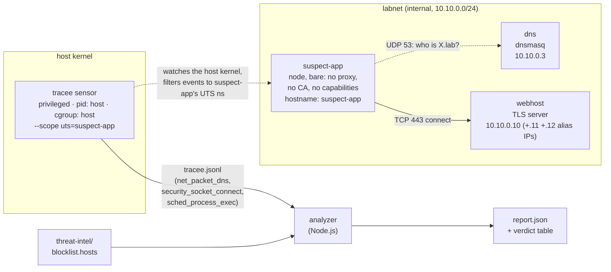

# No proxy, no CA, no cooperation: catch an app phoning home with eBPF

A "freshly downloaded app" makes an ordinary update check, then quietly drops
a helper binary and uses it to beacon a host fingerprint to two servers the
vendor doesn't own. Nobody configured this app to go through anything: no
`HTTPS_PROXY`, no injected certificate authority, no shared network
namespace. This lab still catches it, by instrumenting the Linux kernel
itself with [eBPF](https://ebpf.io/) and watching which *process* opened
which *connection* — never the traffic on the wire.

Everything runs locally in Docker on an offline network. The only "secret"
the app exfiltrates is an obviously-fake canary.

Companion lab: [`lab-app-egress-audit`](../lab-app-egress-audit) (post:
[Is That App You Just Installed Phoning Home?](https://techwithugur.dev/posts/app-egress-audit/))
builds a transparent mitmproxy gateway that decrypts the same kind of app's
traffic and reads the payload. The two labs are two sides of one trade-off:
that lab sees the **payload**, not the process; this one sees the
**process**, not the payload. Post for this lab:
[No Proxy, No CA, No Cooperation](https://techwithugur.dev/posts/app-egress-ebpf/).

## Contents
- [Prerequisites](#prerequisites)
- [Run it](#run-it)
- [What you should see](#what-you-should-see)
- [How it works](#how-it-works)
  - [The three kernel events](#the-three-kernel-events)
  - [The join: IP and pid back to something readable](#the-join-ip-and-pid-back-to-something-readable)
  - [Why the sensor is privileged and the app is bare](#why-the-sensor-is-privileged-and-the-app-is-bare)
  - [Why every domain gets its own IP](#why-every-domain-gets-its-own-ip)
  - [Component by component](#component-by-component)
- [The honest limit](#the-honest-limit)
- [SAFETY](#safety)
- [Clean up](#clean-up)

## Prerequisites
- Docker with Compose v2 (`docker compose version`)
- A Linux host, **or** Docker Desktop with a BTF-enabled kernel — check that
  `/sys/kernel/btf/vmlinux` exists inside the Docker VM. eBPF programs need
  the kernel's own type information (BTF) to attach; without it the `tracee`
  service will fail its healthcheck and the stack won't come up.
- `bash` (for `./e2e.sh`)

## Run it
```bash
docker compose up --build --abort-on-container-exit --exit-code-from analyzer
```
Or run the asserting end-to-end gate, which also checks the compose config
for zero cooperation and tears everything down:
```bash
./e2e.sh
```

## What you should see
The analyzer prints a per-domain verdict table and writes `/out/report.json`:

| FQDN | Verdict | Process | Lineage |
|---|---|---|---|
| `cdn-metrics.tracklab.lab` | malicious | `sys-helper` (`/app/bin/sys-helper`) | `sys-helper ← node ← node ← sh ← node` |
| `telemetry.adnexus.lab` | malicious | `sys-helper` (`/app/bin/sys-helper`) | `sys-helper ← node ← node ← sh ← node` |
| `updates.goodvendor.lab` | clean | `node` (`/usr/local/bin/node`) | `node ← node ← sh ← node` |

Both beacons come out attributed to `sys-helper` — a dropped binary, child of
the main `node` process — while the benign update check is attributed to
`node` itself. That per-process split, from a completely passive kernel
sensor, is the whole point of the lab.

## How it works

### The three kernel events

The sensor is [Tracee](https://github.com/aquasecurity/tracee) (an eBPF
runtime security tool), started with:

```
--scope uts=suspect-app
--events net_packet_dns,security_socket_connect,sched_process_exec
--output json:/events/tracee.jsonl
--output option:parse-arguments
--server http-address=:3366
--server healthz
```

Three event types, each feeding one part of the join:

| Event | Fires when | Gives us |
|---|---|---|
| `net_packet_dns` | a DNS response packet crosses the wire | FQDN → IP (`analyzer/src/dnsAnswers.ts`) |
| `security_socket_connect` | a process calls `connect()` on a TCP socket | IP + port + the pid that dialed it (`analyzer/src/attribute.ts`, filtered to `SOCK_STREAM` / `AF_INET`) |
| `sched_process_exec` | a process replaces its image via `execve` | pid → binary path, `argv`, and parent pid (`analyzer/src/processTable.ts`) |

`--output option:parse-arguments` is what makes Tracee decode each event's
arguments (the DNS answer records, the socket address, the exec path) into
structured JSON instead of raw bytes. Everything lands as one JSON line per
event on the shared `events` volume; the `analyzer` reads it only after the
suspect app has exited (`depends_on: suspect-app: condition:
service_completed_successfully`).

### The join: IP and pid back to something readable

`analyzer/src/attribute.ts` does the actual correlation, in two independent
steps:

1. **Connect → FQDN.** For every `security_socket_connect`, look up the most
   recent `net_packet_dns` answer for that IP *at or before* the connect's
   timestamp (`dnsAnswers.ts`'s `fqdnForIp`). If no DNS answer ever matched
   that IP, the row falls back to the bare IP address.
2. **Connect → lineage.** The connecting pid is looked up in a process table
   built by folding every `sched_process_exec` event
   (`processTable.ts`'s `buildProcessTable`). `lineage()` then walks the
   table by `ppid` — pid → parent → grandparent — until it reaches pid 1 or
   runs out of ancestors, producing the `sys-helper ← node ← node ← sh ←
   node` chains in the table above.

Both steps only ever consume pids, IPs, and timestamps — the kernel's-eye
view. There is no packet payload anywhere in this pipeline.

### Why the sensor is privileged and the app is bare

`tracee` is the **only** service in this stack with `privileged: true`, `pid:
host`, and `cgroup: host`. Loading eBPF programs into the running kernel and
reading every process's syscalls requires that level of access — there's no
way around it for a real kernel sensor. `--scope uts=suspect-app` narrows
what it *reports*: it only emits events from processes whose UTS namespace
hostname is `suspect-app`, which is exactly the `hostname:` compose sets on
that one container.

`suspect-app` itself is deliberately bare: no proxy environment variables, no
injected CA, no added Linux capabilities, no `network_mode` sharing. Its
*only* network-relevant compose keys are `dns:` (pointing at the lab
resolver — no different from what DHCP hands out on a real network) and
`hostname:` (which exists so Tracee has something to scope on, not so the
app can opt in to anything). The app cooperates with nothing; the sensor
watches from outside it entirely. `./e2e.sh` enforces this at the compose
level too — `analyzer/src/verify.ts` fails the run if `suspect-app` ever
grows a proxy env var, `cap_add`, `privileged`, or `network_mode` key.

### Why every domain gets its own IP

`dns/dnsmasq.conf` gives each `.lab` name a *distinct* address
(`updates.goodvendor.lab` → `10.10.0.10`, `cdn-metrics.tracklab.lab` →
`10.10.0.11`, `telemetry.adnexus.lab` → `10.10.0.12`), even though one
`webhost` container answers all three (it adds `.11` and `.12` as alias
addresses on start-up, the same trick the companion lab uses). This matters
here more than it would with a proxy: `security_socket_connect` only ever
gives the analyzer an IP address — there is no SNI or `Host` header to read,
because nothing is decrypting anything. If two FQDNs shared one IP, the
connect-IP → FQDN join would be genuinely ambiguous — the kernel has no way
to tell them apart. Per-name IPs keep the join exact for this lab; a real
CDN sharing one IP across many tenants would not have that property (see
[the honest limit](#the-honest-limit)).



### Component by component

| Service | Role |
|---|---|
| `dns` | Authoritative-only dnsmasq for `*.lab`; no upstream, so anything else fails to resolve. Healthcheck confirms `updates.goodvendor.lab` answers before anything else starts. |
| `webhost` | One TLS server standing in for the vendor and both beacon sinks, reachable on three fixed IPs via `NET_ADMIN`-added alias addresses. Answers everything `200 OK` and logs nothing — the evidence in this lab comes from the kernel, not from an endpoint log. |
| `tracee` | The eBPF sensor described above. Exposes `/healthz` on `:3366`; `suspect-app` waits on that healthcheck before it starts, so no event is missed. |
| `suspect-app` | The instrumented target: `src/index.ts` makes the update check as the main `node` process, then spawns `/app/bin/sys-helper` (`suspect-app/Dockerfile` copies the Node binary to that path at build time) to run `src/helper.ts`, which sends the two beacons. See `suspect-app/src/fingerprint.ts` for what actually gets sent. |
| `analyzer` | Runs only after `suspect-app` exits. Reads `/events/tracee.jsonl` and `/threat-intel/blocklist.hosts` (both read-only), never touches the network, writes `/out/report.json`, and prints the table. `npm run verify` (what `./e2e.sh` calls) re-reads that JSON plus a dumped `docker compose config` and asserts the exact table above, including the zero-cooperation checks on `suspect-app`. |

## The honest limit

The kernel view tells you **where** a process connected and **which process,
with what ancestry, made the call**. It never tells you what was actually
sent — `security_socket_connect` fires on the TCP handshake, long before any
TLS payload exists to read. For that, see the companion lab.

Specific blind spots this design has to live with:

- **Shared-IP / CDN ambiguity.** The connect-IP → FQDN join depends on each
  IP mapping to one name. This lab engineers that to be true (see above);
  many real CDNs put unrelated hostnames behind the same edge IP, which
  makes the join ambiguous or wrong without additional signal (TLS SNI, for
  instance — which itself requires reading past the IP layer).
- **Hard-coded IPs.** An app that skips DNS and connects straight to a
  literal IP is still caught — `security_socket_connect` doesn't care how
  the IP was obtained — but the row has no DNS answer to join against, so it
  shows the bare IP instead of a hostname.
- **DNS-over-HTTPS.** If resolution happens inside an encrypted HTTPS
  request instead of a plaintext UDP/53 packet, `net_packet_dns` never
  fires. The subsequent connect is still observed, but again with no
  hostname attached — the same blind spot as the hard-coded-IP case, reached
  a different way.

## SAFETY
This is a teaching lab and is inert outside itself:
- Every destination is a `.lab` name resolved only by the in-lab `dns`
  service to the in-lab `webhost`. `labnet` is an `internal` Docker network
  with no route to the real internet, so there is nowhere for a connection
  to actually go.
- The exfiltrated "host fingerprint" is a hardcoded, self-labeling fake
  (`FAKE-FP-000-lab-only`, `host: "LAB-CANARY-NOT-A-REAL-HOST"`) — read
  `suspect-app/src/fingerprint.ts`; it reads nothing real off the machine it
  runs on.
- `tracee` is the only privileged service, and its reach is deliberately
  narrowed: `--scope uts=suspect-app` means it only reports events from the
  one container whose UTS hostname matches, and the sensor itself is torn
  down along with the rest of the stack by `docker compose down -v` — it
  installs nothing persistent on the host.
- The "dropped helper" is not malware — it's a plain `cp` of the official
  Node runtime binary to `/app/bin/sys-helper` at image build time
  (`suspect-app/Dockerfile`), used only so the kernel sensor has two
  distinct process identities to tell apart.

## Clean up
```bash
docker compose down -v
```
