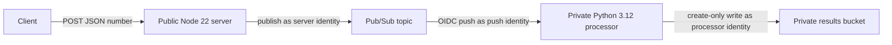
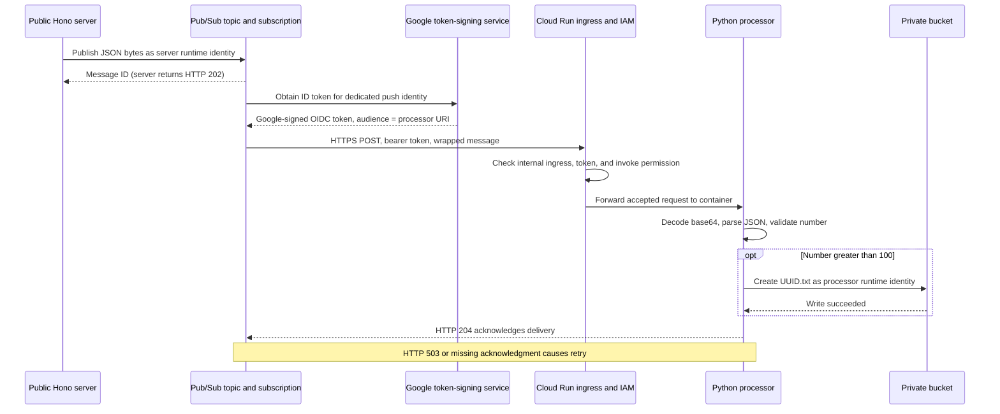

# Event-driven Cloud Run: publish a number, process it, store it

This lab builds a small asynchronous Google Cloud pipeline. A public Hono
service accepts a finite JSON number and publishes it to Pub/Sub. Pub/Sub
sends an authenticated push request to a private Python processor. Values
greater than `100` become UUID-named text objects in a private Cloud Storage
bucket; values at or below `100` are acknowledged and skipped.

> **Cloud verification status:** the application tests, local container
> checks, shell lifecycle tests, and Terraform mock tests have passed. A real
> GCP deployment, authenticated Pub/Sub delivery, live IAM enforcement, and
> cloud teardown have **not** been run for this lab. The cloud commands below
> are an executable walkthrough for your own project. `make check-local` does
> not prove that your project, organization policies, IAM, delivery path, or
> teardown will work.



## Acceptance and completion are separate

`POST /` on the server accepts an object with one finite JSON `number`.
Invalid JSON or an invalid number returns `400` before the publisher is
called. A Pub/Sub publication failure returns `503`. A successful request
returns `202` with only a Pub/Sub receipt:

```json
{"messageId":"1234567890"}
```

That response means Pub/Sub accepted the message. It does not mean the
processor ran or an object exists. Completion is a correlated processor log
with `event="processed"`, the same `message_id`, the number, and an
`outcome` of `stored` or `skipped`. A stored event also names the object.

The processor validates the wrapped Pub/Sub envelope, base64 JSON data,
message ID, and finite number. It deliberately returns `204` for malformed
deliveries so a poison message is acknowledged rather than retried forever.
It also returns `204` after a skip or successful write. A storage failure
returns `503`, which asks Pub/Sub to retry.

## Identity model

| Identity | Direct lab access |
|---|---|
| Server runtime | `roles/pubsub.publisher` on this lab's topic |
| Processor runtime | `roles/storage.objectCreator` on this lab's bucket |
| Push identity | `roles/run.invoker` on the private processor |
| Public clients | Invoke the server through its `allUsers` binding |
| Cloud Run service agent | Pulls the same-project Artifact Registry images through its Google-managed service-agent role |
| Pub/Sub service agent | Mints the push identity's OIDC token through its normal Google-managed role, or an optional legacy account-scoped grant |
| Deployer | Creates, updates, and deletes the lab resources and images |
| Reader/verifier | Reads logs and policies, inspects and cleans test objects, and temporarily impersonates the three lab identities |

The processor does not need Pub/Sub subscriber access. Cloud Run authenticates
the push identity before the request reaches Python, using the processor URI
as the token audience. The runtime accounts do not need image-pull access;
same-project image retrieval is a Cloud Run service-agent operation. If that
Google-managed service-agent grant was removed from your project, restore it
instead of granting Artifact Registry access to the runtime accounts.

Resource-level bindings are additive. A project, folder, or organization
binding can give a runtime identity more access than the table shows. The
verifier reads the visible ancestor allow policies and tests a defined set of
allowed and denied operations, but it cannot prove universal least privilege.

## How a published message reaches the processor

The topic does not call Python directly. The **push subscription** connects
this topic to the processor's default HTTPS `run.app` URL. The two Terraform
roots separate resources needed before image builds from services that need
those images. Each root collects its outputs in `99_outputs.tf`; moving an
output there changes neither its name nor its value.



1. The Hono server publishes the UTF-8 JSON bytes `{"number":101}` using
   its runtime credentials and topic-scoped `roles/pubsub.publisher`.
   Pub/Sub accepts the message and returns a message ID. The subscription
   tracks delivery and acknowledgment independently of the client's request.
2. `terraform/services/06_subscription.tf` sets `push_endpoint` to the
   processor URI and configures `oidc_token.service_account_email` as the
   dedicated push account, with `audience` equal to that same URI.
3. Pub/Sub's Google-managed service agent
   (`service-PROJECT_NUMBER@gcp-sa-pubsub.iam.gserviceaccount.com`) obtains
   a Google-signed ID token representing the push account. It needs
   `iam.serviceAccounts.getOpenIdToken`; its normal service-agent role
   supplies this, with the account-scoped legacy option described below.
   The deployer separately needs `iam.serviceAccounts.actAs` to attach the
   push account to the subscription. Neither operation uses a downloaded key.
4. Pub/Sub sends an HTTPS POST with `Authorization: Bearer <ID_TOKEN>`.
   For same-project Pub/Sub subscriptions using the default `run.app` URL,
   Google recognizes the request as internal and keeps it within Google's
   network. This lab needs no VPC connector, private IP, custom domain,
   load balancer, or Eventarc trigger for that delivery path. The URL alone
   does not grant access. [Cloud Run ingress documentation](https://docs.cloud.google.com/run/docs/securing/ingress)
5. Cloud Run checks the token's signature, validity and audience and the
   caller's `run.routes.invoke` permission before forwarding the request
   to Python. The service-scoped `roles/run.invoker` binding in
   `terraform/services/05_processor.tf` grants that permission to the push
   account. The Python container runs as the **processor runtime account**,
   not the caller's push account. [Push authentication documentation](https://docs.cloud.google.com/pubsub/docs/authenticate-push-subscriptions)

For example, the POST body is a wrapped Pub/Sub message (IDs and timestamp
below are illustrative):

```json
{
  "message": {
    "data": "eyJudW1iZXIiOjEwMX0=",
    "messageId": "1234567890",
    "publishTime": "2026-09-22T10:00:00Z"
  },
  "subscription": "projects/your-project/subscriptions/number-pipeline-push"
}
```

`message.data` is base64 encoding of `{"number":101}`, not encryption. The
processor decodes it, validates the number, and writes `101` into a fresh
UUID-named object using its own bucket-scoped create permission. It returns
`204` only after a successful write or deliberate skip; `503` lets Pub/Sub
retry. The HTTP response is the acknowledgment—Python never polls a
subscription or calls an acknowledgment API. See [push delivery and response codes](https://docs.cloud.google.com/pubsub/docs/push).

### What “only Pub/Sub can invoke” means here

Two independent controls protect the processor:

- **Network:** `INGRESS_TRAFFIC_INTERNAL_ONLY` rejects internet-origin
  requests, including a laptop request carrying a valid push-account token.
  The same-project push subscription can reach the default `run.app` URL.
- **Identity:** the only direct invoker grant created by the lab is for its
  dedicated push account. Neither the server runtime nor the processor
  runtime gets this grant; there is no processor `allUsers` binding.

Internal ingress is not an allowlist of one subscription: other eligible
internal sources exist. IAM authenticates the identity, not a particular
subscription ID or JSON body. Someone who can impersonate the push account
and use an allowed internal path can also invoke the service. Inherited
invoker grants or an administrator changing policy can widen access. Keep
that account dedicated to delivery, restrict who can mint its tokens or
attach it to subscriptions, and remove the verifier's temporary impersonation
grants after testing. A `subscription` field in a request is not authentication.

Run `make e2e` from a laptop or another host **outside** an allowed internal
network path. It checks live processor ingress and URL, expects `404` for
external requests both without credentials and with a push-account token,
and verifies real successful delivery through the public server, correlated
processor logs, and the stored object. An ingress rejection is not proof of
an IAM denial; direct policies and readable inherited policies are assessed
separately. Running this external-boundary test from an allowed internal
source intentionally fails its expected status. [Cloud Run 404 troubleshooting](https://docs.cloud.google.com/run/docs/troubleshooting#http_404_not_found)

## Credential-free local checks

From a fresh clone, this path needs package and provider registry access but
no Google Cloud credentials:

```bash
git clone https://github.com/utr1903/tech-with-ugur-labs.git
cd tech-with-ugur-labs/labs/lab-cloud-run-pubsub-number-processor
make check-local
```

Install Bash 5 or newer, Make, jq, ShellCheck, Terraform `1.14.8`, uv, and a
running Docker Engine/Desktop with Buildx. Stock macOS Bash 3.2 is rejected;
put a newer Bash first on `PATH`. The local check runs the TypeScript suite in
`node:22.20.0-bookworm-slim` on `linux/amd64`, so host Node is unnecessary.
It runs Python with `uv sync --locked --python 3.12`; the deployed processor
image is `python:3.12.12-slim-bookworm`, and its build pins uv `0.9.16`.
Terraform pins the Google and Google Beta providers to `8.2.0`.

`make check-local` runs shell syntax and ShellCheck, fake-command lifecycle
and IAM tests, TypeScript tests/typechecking/lint/dependency checks, Python
tests/typechecking/lint/dependency checks, Terraform formatting and
validation, and mock-provider Terraform tests. It finishes by stating that no
GCP deployment, IAM enforcement, delivery, or teardown was exercised.

## Seven-step cloud walkthrough

### 1. Prepare the project, credentials, and access

Use a reader-owned, active GCP project with billing enabled. The selected
region must support Cloud Run, Artifact Registry, and Cloud Storage; the
default is `europe-west1`. This lab creates cost-bearing Cloud Run, Pub/Sub,
Artifact Registry, Cloud Storage, and Cloud Logging resources. Both services
scale from zero to at most two instances, with 1 CPU, 512 MiB, concurrency 20,
and a 60-second request timeout. The server is public, so any caller can cause
work and cost until you tear it down.

The Terraform configuration grants `allUsers` Cloud Run Invoker on the
server. Your organization policy must permit that binding. If domain-restricted
sharing, an allowed-ingress policy, or a VPC Service Controls perimeter blocks
the configuration, use a dedicated project with an approved exception. Do not
weaken an organization policy just to run the lab.

Install the cloud prerequisites in addition to the local tools: the Google
Cloud CLI and a working Docker daemon with Buildx. Then authenticate the
gcloud CLI and Application Default Credentials (ADC) deliberately as the same
intended human principal:

```bash
export PROJECT_ID="your-billing-enabled-project-id"
export REGION="europe-west1"
export LAB_NAME="number-pipeline"

gcloud auth login
gcloud auth list --filter=status:ACTIVE

gcloud auth application-default login
gcloud auth application-default set-quota-project "$PROJECT_ID"
gcloud auth application-default print-access-token >/dev/null
```

The gcloud CLI uses the active CLI account; Terraform uses ADC. The scripts
pass `PROJECT_ID` explicitly and do not change your global gcloud project,
login, quota project, or impersonation grants. The ADC principal needs
`serviceusage.services.use` on the quota project. No service-account key is
created or downloaded.

The deployer needs these capabilities on the project. The listed predefined
roles are a straightforward setup for a disposable lab project; a custom role
may narrow them further.

| Capability | Typical role |
|---|---|
| Enable and use required APIs | `roles/serviceusage.serviceUsageAdmin` |
| Create/delete Cloud Run services and manage their IAM | `roles/run.admin` |
| Create/delete Pub/Sub topics/subscriptions and manage topic IAM | `roles/pubsub.admin` |
| Create/delete the bucket, manage bucket IAM, and remove its objects | `roles/storage.admin` |
| Create/delete repositories and push images | `roles/artifactregistry.admin` |
| Create/delete service accounts and manage their IAM | `roles/iam.serviceAccountAdmin` |
| Attach the server, processor, and push accounts to resources (`iam.serviceAccounts.actAs`) | `roles/iam.serviceAccountUser` |

The reader identity used by `make e2e` needs:

- `roles/logging.viewer` on the project;
- `roles/storage.objectAdmin` on the lab bucket, after the bucket exists, so
  it can inspect and clean exact verifier objects;
- `roles/iam.securityReviewer` at the organization, or equivalent custom
  read permissions on every actual project/folder/organization ancestor and
  the two Cloud Run policies; and
- `roles/serviceusage.serviceUsageConsumer` on the project for API quota.

At minimum, the hierarchy check calls for
`resourcemanager.projects.get`, `resourcemanager.projects.getIamPolicy`,
`resourcemanager.folders.getIamPolicy`,
`resourcemanager.organizations.getIamPolicy`, and
`run.services.getIamPolicy`, and `run.services.get` at their corresponding
resources. If any ancestor
policy cannot be read, the verifier stops instead of reporting a pass.

### 2. Bootstrap the staged deployment

Run from this lab directory:

```bash
make bootstrap PROJECT_ID="$PROJECT_ID" REGION="$REGION" LAB_NAME="$LAB_NAME"
```

Bootstrap checks the active project, billing, CLI login, ADC, API-enable
permission, Docker Buildx, and daemon before creating resources. It then:

1. initializes and applies `terraform/foundation`;
2. enables the APIs, creates three service accounts, two repositories, the
   topic, bucket, and scoped runtime IAM bindings;
3. builds both images for `linux/amd64`, pushes them, and resolves their
   registry digests;
4. initializes and applies `terraform/services` with immutable `@sha256`
   image references; and
5. creates the public server, private processor, and authenticated push
   subscription.

The image build uses the Docker CLI's currently selected context and the
Buildx executable exposed by that context. It creates a temporary Docker
configuration, imports only a selected non-default context, and passes that
context as `--builder`. It does not copy existing registry authentication,
credential helpers, unrelated contexts, or arbitrary custom builder state.
The temporary configuration and Artifact Registry access token are removed on
exit. An exported non-default context can contain TLS connection material; it
exists only in that temporary directory.

`LAB_NAME` defaults to `number-pipeline` and accepts 4–19 lowercase letters,
digits, or hyphens, starting with a letter and ending with a letter or digit.
The project, region, name, and legacy flag are saved as JSON in ignored
`.lab/config.json`; resolved image digests are saved in ignored
`.lab/images.json`. Later `make e2e` and `make teardown` load those files.
Conflicting explicit inputs fail before cloud calls. The JSON is parsed as
data and is never sourced as shell code.

For a legacy or custom project where the Pub/Sub service agent lacks its
normal token-minting permission, set this only on the first bootstrap:

```bash
make bootstrap PROJECT_ID="$PROJECT_ID" REGION="$REGION" \
  LAB_NAME="$LAB_NAME" LEGACY_TOKEN_CREATOR=true
```

That option grants the Pub/Sub service agent Token Creator only on the push
account. It does not grant a project-wide runtime or reader role. If you first
bootstrap with the default and later discover this legacy requirement, run a
successful teardown before changing the saved flag.

Bootstrap is safe to rerun with the same saved inputs after a partial failure.
Terraform converges the existing foundation, the images are rebuilt and
resolved by digest, and the services stage is applied again. Keep `.lab/`,
both Terraform state files, and their `.terraform/` directories until cleanup
succeeds.

To inspect plans directly:

```bash
./scripts/deploy_cloud.sh --dry-run
./scripts/deploy_cloud.sh --dry-run --destroy
```

On a fresh checkout, the first command plans the foundation and then exits
because no saved image digests exist for a services plan. Dry runs do not
build, push, apply, or save configuration. After bootstrap, the first command
can plan both roots using the saved digests.

### 3. Publish `101`

Read the actual server URL from Terraform and keep the `202` receipt:

```bash
SERVER_URL="$(terraform -chdir=terraform/services output -raw server_url)"
response_file="$(mktemp)"
http_code="$(curl --silent --show-error --output "$response_file" \
  --write-out '%{http_code}' --request POST \
  --header 'Content-Type: application/json' \
  --data '{"number":101}' "$SERVER_URL/")"
cat "$response_file"
printf '\nHTTP %s\n' "$http_code"
[[ "$http_code" == 202 ]]
MESSAGE_ID="$(jq -er '.messageId | select(test("^[0-9]+$"))' "$response_file")"
rm -f "$response_file"
```

The body contains only `messageId`. It is the correlation key for completion.

### 4. Correlate the completion and inspect the object

Use the reader identity, not a runtime identity:

```bash
deployment="$(terraform -chdir=terraform/foundation output -json deployment)"
BUCKET="$(jq -er '.bucket' <<<"$deployment")"

event="$(gcloud logging read \
  "resource.type=cloud_run_revision AND resource.labels.service_name=\"$LAB_NAME-processor\" AND jsonPayload.event=\"processed\" AND jsonPayload.message_id=\"$MESSAGE_ID\" AND jsonPayload.outcome=\"stored\"" \
  --project="$PROJECT_ID" --freshness=1h --order=asc --limit=1 --format=json)"
printf '%s\n' "$event" | jq .
OBJECT_NAME="$(jq -er '.[0].jsonPayload.object_name' <<<"$event")"

gcloud storage ls "gs://$BUCKET"
gcloud storage cat "gs://$BUCKET/$OBJECT_NAME"
```

Log ingestion and Pub/Sub delivery are asynchronous, so repeat the log read if
it initially returns `[]`. The object content for this request is exactly
`101`. The processor writes with `ifGenerationMatch=0`, which prevents an
overwrite if a generated name already exists.

### 5. Inspect skips and understand retries

Publish the threshold value and correlate its skipped completion:

```bash
skip_response="$(curl --silent --show-error --fail-with-body \
  --request POST --header 'Content-Type: application/json' \
  --data '{"number":100}' "$SERVER_URL/")"
SKIP_ID="$(jq -er '.messageId | select(test("^[0-9]+$"))' <<<"$skip_response")"

gcloud logging read \
  "resource.type=cloud_run_revision AND resource.labels.service_name=\"$LAB_NAME-processor\" AND jsonPayload.event=\"processed\" AND jsonPayload.message_id=\"$SKIP_ID\" AND jsonPayload.outcome=\"skipped\"" \
  --project="$PROJECT_ID" --freshness=1h --limit=100 --format=json
```

The skipped event has no `object_name`. Values below `100` behave the same.
The automated verifier checks `100` and `99`, then watches each message for a
bounded 30-second window for an unexpected stored event. That window cannot
prove an object will never appear.

Do not remove runtime permissions to manufacture a retry. If a real transient
storage failure occurs, inspect it with:

```bash
gcloud logging read \
  "resource.type=cloud_run_revision AND resource.labels.service_name=\"$LAB_NAME-processor\" AND jsonPayload.event=\"Processing delivery failed.\"" \
  --project="$PROJECT_ID" --freshness=1h --limit=100 --format=json
```

A storage failure returns `503`. The subscription retains messages for 24
hours, uses a 60-second acknowledgement deadline, and backs retries off from
10 to 60 seconds. Pub/Sub delivery is at least once. Each redelivery generates
a fresh UUID, so a response lost after a successful write can produce another
object for the same message. The UUID and create-only precondition prevent
overwrite; they do not deduplicate deliveries. Malformed deliveries return
`204` and are not retried as poison messages.

### 6. Run the bounded cloud and IAM verifier

The verifier impersonates exactly the server, processor, and push identities
with short-lived tokens. It never creates keys or grants itself access. After
bootstrap, have an authorized administrator temporarily grant the verifier
Token Creator on those three accounts:

```bash
export VERIFIER_MEMBER="user:you@example.com"

for suffix in server processor push; do
  sa="$LAB_NAME-$suffix@$PROJECT_ID.iam.gserviceaccount.com"
  gcloud iam service-accounts add-iam-policy-binding "$sa" \
    --project="$PROJECT_ID" \
    --member="$VERIFIER_MEMBER" \
    --role='roles/iam.serviceAccountTokenCreator'
done
```

Use `serviceAccount:name@project.iam.gserviceaccount.com` for
`VERIFIER_MEMBER` when the verifier is a service account. Do not add test
permissions to any runtime account.

Run the verifier as that active gcloud identity:

```bash
make e2e
```

It checks:

- live processor configuration keeps internal ingress and IAM enforcement,
  and external unauthenticated invocation returns `404`;
- invalid public inputs return `400` (the stronger no-publication guarantee
  comes from the local injected-publisher tests);
- a unique qualifying number reaches a correlated stored log and exact object;
- `100` and `99` reach skipped logs without a stored completion during the
  observation windows;
- even a valid push-identity token cannot invoke the processor from the
  external verifier host; successful authenticated push delivery is established
  by the correlated end-to-end processing checks;
- the server can publish but cannot perform tested Storage operations;
- the processor can create a new object but cannot publish, list, read, delete,
  or overwrite; and
- readable ancestor allow policies and direct Cloud Run invocation bindings
  contain no unresolved access that would invalidate those conclusions.

Defaults are 180 seconds per completion poll, 30 seconds of observation after
each skip, and a 3-second polling interval. Each can be set to 1–999 seconds:

```bash
E2E_TIMEOUT=300 E2E_OBSERVE=60 E2E_INTERVAL=5 make e2e
```

Each curl call also has a 30-second timeout; a gcloud call can add its own
duration. The verifier deletes the exact objects it registers, even after most
failures, and fails if cleanup fails. A redelivery can leave another UUID
object for teardown.

Remove the three temporary impersonation grants after `make e2e`, including
when the verifier fails:

```bash
for suffix in server processor push; do
  sa="$LAB_NAME-$suffix@$PROJECT_ID.iam.gserviceaccount.com"
  gcloud iam service-accounts remove-iam-policy-binding "$sa" \
    --project="$PROJECT_ID" \
    --member="$VERIFIER_MEMBER" \
    --role='roles/iam.serviceAccountTokenCreator'
done
```

The policy assessment is deliberately conservative. It rejects unreadable or
malformed evidence, broad principals, groups, domains, principal sets, and
unexpected grants involving the lab identities. It inspects readable allow
policies and tests current operations. It does not resolve group membership,
fully evaluate conditions or custom roles, inspect every deny policy, test
every permission, or establish future behavior. A failure to assess is not a
least-privilege pass.

### 7. Tear down in reverse order

Preview and then destroy:

```bash
./scripts/deploy_cloud.sh --dry-run --destroy
make teardown
```

Teardown destroys the services root first, then the foundation root. It stops
at the first failure so dependencies remain recoverable. Rerun `make teardown`
with the saved configuration after fixing the cause.

The destroy removes only resources tracked by these two local Terraform
states: the two services, push subscription, topic, three service accounts,
private bucket and its contents, and the two repositories and their images.
It preserves the existing project, unrelated resources, and all enabled APIs.
Successful teardown removes `.lab/config.json` and `.lab/images.json` but
retains the local Terraform state and initialization directories. A failed
apply or destroy retains config, images, and state for a safe retry.

## Official references

- [Set up Application Default Credentials](https://docs.cloud.google.com/docs/authentication/provide-credentials-adc)
- [Application Default Credentials quota project](https://docs.cloud.google.com/sdk/gcloud/reference/auth/application-default/set-quota-project)
- [Authenticate Pub/Sub push subscriptions](https://docs.cloud.google.com/pubsub/docs/authenticate-push-subscriptions)
- [Cloud Run access control and public services](https://docs.cloud.google.com/run/docs/securing/managing-access)
- [Cloud Run IAM roles and service-agent image access](https://docs.cloud.google.com/run/docs/reference/iam/roles)
- [Cloud Storage IAM roles](https://docs.cloud.google.com/storage/docs/access-control/iam-roles)
- [Resource hierarchy access control](https://docs.cloud.google.com/iam/docs/resource-hierarchy-access-control)
