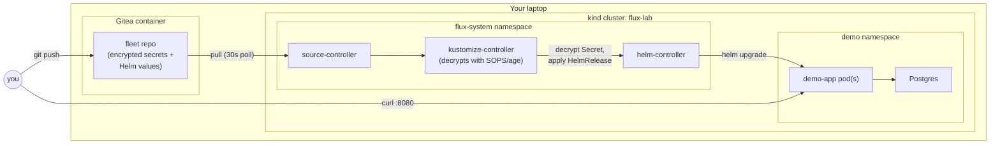

# GitOps that survives bad days: Flux + Helm on your laptop

Every GitOps quickstart shows you the happy path: push a commit, watch a
controller apply it, done. That part is genuinely easy, and it is not where
GitOps earns its keep. The hard part — the part that decides whether you
trust the system at 2am — is what happens when a deploy is *wrong*: when the
new image doesn't exist, when a migration hook wedges, when someone
"quick-fixes" production by hand. This lab builds a complete, disposable
GitOps loop on your own machine — Flux reconciling Helm releases from a
local git server — and then deliberately breaks it five different ways, so
you can watch the actual recovery mechanics instead of taking them on faith.

Companion post: [GitOps That Survives Bad Days: Flux, Helm, encrypted secrets, and self-healing rollbacks](https://techwithugur.dev/posts/flux-helm-gitops/).

## What you build

A local git remote (Gitea), a local Kubernetes cluster (kind) running Flux's
controllers, and a small Node.js app with a Postgres database, all wired
together so that git is the only place you're allowed to make a lasting
change.



Everything runs in Docker and kind — no cloud account, no GitHub, no
external registry. Tear it down and there's nothing left outside this
folder's `tmp/` directory.

## Prerequisites

Tested on macOS with Docker Desktop (allow it roughly 4 GB of RAM — the
cluster, Gitea, and the app/db pods all run concurrently). Install
everything with:

```bash
brew install kind kubectl helm fluxcd/tap/flux sops age yq jq
```

Tested-with versions:

| Tool | Version |
| --- | --- |
| Docker | 28.3.2 |
| kind | 0.31.0 (node image `kindest/node:v1.35.0`) |
| kubectl | 1.36.2 |
| Helm | 4.2.2 |
| Flux CLI | 2.9.4 |
| sops | 3.13.3 |
| age | 1.3.1 |
| yq | 4.53.3 |
| jq | 1.8.2 |
| shellcheck | 0.11.0 |

Container images used: `gitea/gitea:1.26.1`, `postgres:18.6-alpine`,
`node:22.23.2-alpine` (the app's base image).

Run `./scripts/check-prereqs.sh` at any time to confirm the host has
everything installed and Docker is running.

## Quickstart

```bash
./scripts/up.sh
```

`up.sh` builds the whole stack from nothing, in eight stages, each with its
own status line:

1. **Starting Gitea** — creates the shared `kind` Docker network if it's
   missing and brings up the Gitea container as the lab's git remote.
2. **Creating the Gitea user and fleet repository** — provisions the
   `labowner` account and an empty `fleet` repo over Gitea's API.
3. **Building the demo-app image** — one Docker build, tagged three ways
   (`v1`, `v2`, `v4`). All three tags point at identical bytes on purpose:
   the app's behavior comes entirely from Helm values (`appVersion`,
   `migrateTo`), and the tags exist only to give Flux/Helm something to
   diff and re-deploy against.
4. **Creating the kind cluster** — spins up `flux-lab`, side-loads the three
   `demo-app` images, and pulls + imports the Postgres image into the
   node's containerd store directly (see the honesty notes below for why
   Postgres gets special handling).
5. **Teaching cluster DNS to resolve `gitea`** — patches CoreDNS's
   `Corefile` with a `hosts` block pointing `gitea` at the Gitea container's
   IP on the shared Docker network, so pods inside the cluster can reach the
   git server the same way the host does.
6. **Generating secrets and seeding the fleet repo** — generates an age
   keypair and random values for the API token and Postgres password
   (nothing here is ever committed in plaintext), encrypts them with
   `sops`, and pushes the initial `apps/` + `charts/` tree to the fleet
   repo.
7. **Installing Flux and pointing it at the fleet repo** — `flux install`,
   an in-cluster `sops-age` Secret holding the decryption key, and the
   `GitRepository`/`Kustomization` sync manifests.
8. **Waiting for the first reconciliation** — blocks until the
   `GitRepository` has fetched, the `Kustomization` has applied, the
   `HelmRelease` is `Ready`, and the app answers with its decrypted token.

If `up.sh` fails partway through, run `./scripts/down.sh` first and then
start `./scripts/up.sh` again from scratch, rather than re-running it
in place.

When it finishes you'll see:

```
GitOps loop is up:
  Gitea UI:   http://localhost:3000 (labowner / password in tmp/gitea-password)
  App:        http://localhost:8080/api/messages (token in tmp/api-token)
  Watch Flux: flux get helmreleases -n demo --watch
```

Open `http://localhost:3000`, log in as `labowner` with the password from
`cat tmp/gitea-password`, and browse to the `fleet` repository — that's the
entire desired state of the cluster: the `HelmRelease`, the namespace, the
Postgres manifests, and the encrypted secret. Call the app the same way
Flux's health checks do:

```bash
curl -H "Authorization: Bearer $(cat tmp/api-token)" http://localhost:8080/api/messages
```

Each scenario below is one-shot per bring-up: they advance the fleet repo's
git history from v1 through v2 to v3/v4 in order, so running one out of
order or twice will not behave as described. To replay from the top, run
`./scripts/down.sh && ./scripts/up.sh` and start again from Scenario 1.

## Scenario 1: encrypted secrets

Demonstrates that the git remote never holds a usable secret — only
`kustomize-controller`, armed with the in-cluster age key, can turn the
ciphertext into a real Kubernetes `Secret`.

```bash
./scripts/scenario-1-secrets.sh
```

Expected output:

```
--> What git actually stores (sops metadata, ciphertext values):
    apiToken: ENC[AES256_GCM,data:gR7pze0K8y7w+BHm2aFAJkEO+zr6AgUPO3CIdvizj3s=,iv:...
sops:
    age:
          recipient: age1n2wfcyk2d7dj899ah4g2kpl5zk5mevys5dhjll8vdjgtx7xfzghs78t29h
OK: the real token appears nowhere in git
--> The cluster Secret exists (kustomize-controller decrypted it with the age key):
demo-secrets
--> A request without the token is rejected:
OK: 401
--> A request with the decrypted token succeeds:
{
  "version": 1,
  "messages": [ { "id": 1, "body": "hello from schema v1" } ]
}
```

**What just happened:** the fleet repo's `apps/secret.enc.yaml` is a
regular Kubernetes `Secret` manifest with its `stringData` values run
through `sops --encrypt`. The `Kustomization`'s `spec.decryption.provider:
sops` tells `kustomize-controller` to decrypt every SOPS-encrypted manifest
under `apps/` using the age private key mounted from the `sops-age` Secret
before applying it — so the plaintext only ever exists inside the cluster,
never in git, never on disk outside `tmp/`.

## Scenario 2: hook-ordered migration

Demonstrates that a Helm pre-upgrade hook genuinely blocks the rollout
until it finishes — the new app code never sees an un-migrated database.

```bash
./scripts/scenario-2-migration.sh
```

Expected output:

```
--> Committing the v2 release (new image tag, APP_VERSION=2, migrate to schema 2)
OK: migration job for schema 2 completed
OK: v2 rollout complete
OK: HelmRelease Ready again
--> Proving hook ordering: the migration finished BEFORE the v2 pod started
    migration completed: 2026-08-18T22:07:41Z
    v2 pod started:      2026-08-18T22:07:44Z
OK: hook ran first
--> The new schema is live (messages now carry an author):
{
  "version": 2,
  "messages": [
    { "id": 1, "body": "hello from schema v1", "author": "anonymous" },
    { "id": 2, "body": "hello from schema v2", "author": "flux" }
  ]
}
```

**What just happened:** the chart's migration `Job` carries the annotation
`helm.sh/hook: pre-install,pre-upgrade`, which tells Helm to run it — and
wait for it to complete — before touching the `Deployment` at all. The
script proves the ordering directly rather than trusting it: it compares
the Job's `status.completionTime` against the new pod's
`status.containerStatuses[0].state.running.startedAt`, and the former is
always earlier. If the migration Job fails, the `Deployment` update never
happens.

## Scenario 3: automatic rollback

Demonstrates GitOps' answer to `helm upgrade --atomic`: a broken release
never gets a chance to serve traffic.

```bash
./scripts/scenario-3-rollback.sh
```

Expected output:

```
--> Committing v3, whose image tag does not exist anywhere
--> Flux attempts the upgrade; the hook pod can never start (no such image).
    upgrade.remediation rolls the release back to the last good revision.
OK: helm reports a rollback to a deployed state
--> Helm's own history tells the story:
REVISION  UPDATED                   STATUS      CHART                        APP VERSION  DESCRIPTION
4         Tue Aug 18 22:15:01 2026  superseded  demo-app-0.1.0+85f61d2fbe4a  1            Upgrade complete
5         Tue Aug 18 22:15:07 2026  failed      demo-app-0.1.0+85f61d2fbe4a  1            Upgrade "demo-app" failed: pre-upgrade hooks failed: failed early due to stalled resources: [Job/demo/demo-app-migrate-2-v3 status: 'Failed']
6         Tue Aug 18 22:17:03 2026  deployed    demo-app-0.1.0+85f61d2fbe4a  1            Rollback to 4
--> The running deployment is back on the v2 image:
    running image: demo-app:v2
--> And the app never stopped serving v2:
{ "version": 2, "messages": [ ... ] }
```

**What just happened:** `v3` is an image tag that was never built, so the
migration Job's pod can never be scheduled and the hook stalls out. The
`HelmRelease`'s `spec.upgrade.remediation.strategy: rollback` (with
`retries: 2` and `remediateLastFailure: true`) tells `helm-controller` to
treat that as an upgrade failure and immediately roll the release back to
the last successful revision — visible in `helm history` as description
`Rollback to <N>` (Helm v4's wording; older Helm releases you'll find in
the wild sometimes phrase it slightly differently, but the mechanism is the
same). The app never goes down: Kubernetes never replaces the running v2
pods with anything, because the new revision never got far enough to reach
the `Deployment`.

## Scenario 4: retries exhausted, then recovery

Demonstrates the state most GitOps tutorials skip: what happens after Flux
gives up retrying, and how you get out of it.

```bash
./scripts/scenario-4-recovery.sh
```

Expected output:

```
--> Waiting for Flux to give up on v3 (retries: 2 means three failed attempts total)...
OK: HelmRelease Stalled condition reports RetriesExceeded
--> The stuck state, verbatim:
    Stalled: Failed to upgrade after 3 attempt(s)
    Ready:   Helm rollback to previous release demo/demo-app.v8 with chart demo-app@0.1.0+85f61d2fbe4a succeeded
--> Note what Flux does now: nothing. No retry loop, no self-recovery.
    Forcing reconciliation of the same broken spec does not help:
OK: still stuck — only a spec change (or suspend/resume) resets the retry budget
--> The recovery: fix the desired state in git. Committing working v4.
OK: HelmRelease Ready after the fix
--> Recovered: running demo-app:v4, release Ready.
```

**What just happened:** each failed upgrade attempt against `v3` rolls
back (scenario 3) and increments `status.upgradeFailures`. Once that
reaches `spec.upgrade.remediation.retries` (`2`, meaning three total
attempts), `helm-controller` stops trying and sets a separate `Stalled`
condition — `reason: RetriesExceeded`, message `Failed to upgrade after 3
attempt(s)` — rather than folding that wording into the `Ready` condition.
That's the exact string this stack produces; if you go looking online
you'll also see the older community shorthand "upgrade retries exhausted"
for the same state — same idea, different controller version's wording.
Crucially, `Stalled` is a dead end on its own: re-running `flux reconcile
helmrelease` against the same broken spec changes nothing, because the
retry budget only resets on a new `HelmRelease` generation. Pushing a
working `v4` bumps that generation — the values change is what unsticks it,
not any special "unstuck" command — and `helm-controller` immediately tries
again and succeeds. When there's genuinely nothing to change in git (the
spec was fine, something external is the problem), the equivalent reset is
`flux suspend helmrelease demo-app -n demo && flux resume helmrelease
demo-app -n demo`.

## Scenario 5: drift detection

Demonstrates that a manual `kubectl` edit doesn't stick — git remains the
only durable source of truth.

```bash
./scripts/scenario-5-drift.sh
```

Expected output:

```
--> Someone 'fixes production' by hand:
deployment.apps/demo-app scaled
replicas now: 3
--> Asking Flux to reconcile (normally the 1m interval would catch it):
OK: replicas corrected back to 1
--> Git said 1 replica, so it is 1 replica again. The cluster is not the source of truth.
```

**What just happened:** the `HelmRelease` has `spec.driftDetection.mode:
enabled`, so on every reconciliation `helm-controller` diffs the live
cluster objects against what the current Helm release actually rendered,
not just against what it remembers deploying. The manual `kubectl scale`
shows up as drift, and the controller patches it straight back — you can
see both sides of it in `flux events`, as a `DriftDetected` event
immediately followed by a `DriftCorrected` one. In normal operation this
happens automatically every reconcile interval (`1m` here); the script
forces it with `flux reconcile` just so the fix is visible on a human
timescale instead of waiting out the interval.

## Honesty notes

- **`v1`, `v2`, and `v4` are the same image bytes on purpose.** The app's
  behavior is entirely values-driven (`appVersion`, `migrateTo`); the tags
  exist only so each deploy gives Flux and Helm a new value to reconcile
  against. Don't read anything into the tag numbers themselves.
- **`v3` is broken by design** — it's a tag that is never built or loaded
  into the cluster, specifically so the pre-upgrade hook can never start
  and the upgrade fails deterministically. It's the one tag in this lab
  that must never exist.
- **This lab uses `flux install` plus its own sync manifests
  (`infra/flux-sync.yaml`) instead of `flux bootstrap git`.** `flux
  bootstrap` wants a single git URL that both the Flux CLI on your host and
  the cluster's `source-controller` can reach identically, and on Docker
  for Mac that's not true here: the host talks to Gitea over
  `localhost:3000`, while pods inside the kind cluster need the
  Docker-network address wired up in the CoreDNS `hosts` block
  (`up.sh` stage 5). Installing Flux directly and applying the
  `GitRepository`/`Kustomization` by hand sidesteps that split cleanly.
- **`driftDetection` can occasionally produce a benign extra Helm
  revision.** During a real upgrade you may see `helm history` show one
  more intermediate revision than the two you'd expect (old → new) — a
  drift-correction pass reacting to the pre-upgrade hook Job's completion
  landing a moment before the real upgrade's new spec is picked up. It
  self-resolves within the same reconcile cycle and never affects the
  final state; the scenario scripts only assert on settled state, not on
  revision counts, for exactly this reason.
- **Loading the Postgres image is a workaround, not the normal path.**
  `up.sh` doesn't use `kind load docker-image` for `postgres:18.6-alpine`:
  Docker Desktop's containerd image store only keeps the native-platform
  layers of a registry-pulled multi-arch image, but `kind load
  docker-image` asks `ctr` to import `--all-platforms` and fails looking
  for content that was never pulled. Instead `up.sh` does a `docker save`
  of just that image and `ctr images import`s the resulting archive
  straight into the kind node's containerd namespace. Also note:
  `postgres:18` mounts its data directory at `/var/lib/postgresql`, not
  the `/var/lib/postgresql/data` you may remember from older Postgres
  images — the chart's volume mount matches the newer path.

## One-shot verification

```bash
./scripts/e2e.sh
```

Runs the whole thing end to end with no manual steps: a clean teardown, a
full `up.sh`, all five scenarios in order, then a final teardown. It exits
non-zero and prints which stage failed the moment anything goes wrong. Give
it roughly 10–15 minutes — most of that is scenario 4 deliberately waiting
out Flux's real retry budget (three attempts against a 2-minute per-attempt
timeout) instead of faking the wait.

## Teardown

```bash
./scripts/down.sh
```

Deletes the kind cluster, brings the Gitea container down along with its
volume, removes the locally built `demo-app` images, and removes this lab's
`tmp/` directory — nothing from a run survives teardown, including the age
key and generated secrets. The one thing that intentionally does survive is
the shared `kind` Docker network created in stage 1, since it's meant to be
reused across runs and by other `kind` clusters on the same machine; remove
it yourself with `docker network rm kind` if you want it gone too. Run
`./scripts/up.sh` again any time for a completely fresh stack.

## Layout

```
app/                  the demo Node.js/TypeScript service + its migration CLI
  src/server/          HTTP routes and bearer-token auth
  src/db/               Postgres pool, message queries, schema migrations
  src/migrate.ts        entrypoint the pre-upgrade hook Job runs
config-repo/           the desired state — this tree is what gets pushed to fleet
  apps/                 namespace, HelmRelease, Postgres manifests, encrypted Secret
                         (apps/secret.enc.yaml is generated by up.sh straight into the
                         seeded fleet repo and intentionally isn't in this checkout, so
                         `kustomize build` against config-repo/apps here is expected to fail)
  charts/demo-app/      the Helm chart (Deployment, migration Job hook, Service)
infra/                 host-side cluster bootstrapping
  kind-config.yaml       cluster + port-mapping definition
  flux-sync.yaml         GitRepository + Kustomization Flux is installed against
scripts/               everything you actually run
  up.sh / down.sh        bring the whole stack up / tear it all down
  scenario-*.sh          the five scenarios described above
  e2e.sh                 one-shot verification of the entire lab
  lib.sh                 shared constants and helpers, sourced (not executed)
```
