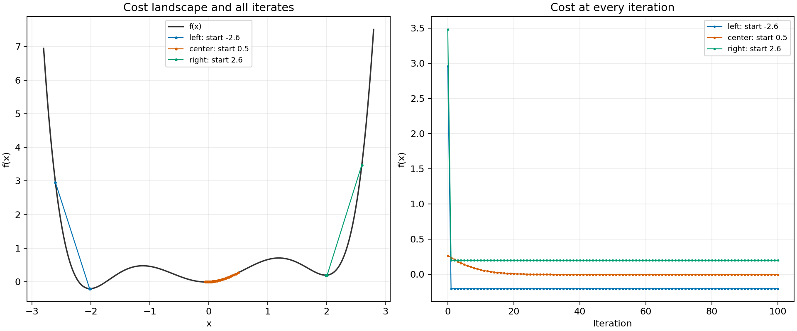

# Gradient descent in one dimension

See how the same update rule reaches three different valleys when only the
starting point changes. This small experiment uses a scalar parameter and a
nonconvex cost, so every step can be shown and checked.



*Three starts approach different valleys; the left path finishes with the lowest cost. Run the lab to reproduce this figure in `output/gradient-descent.png`.*

Read the [walkthrough](https://techwithugur.dev/posts/gradient-descent-1d/) for
the update rule, a few table rows, and what the three endings establish.

## Run

Install Docker with Docker Compose, then run from this directory:

```sh
docker compose up --build
```

The container runs once and exits successfully. It writes these files into the
host's `output/` directory; running again overwrites them:

| File | Contents |
| --- | --- |
| `gradient-descent.png` | Two panels: cost landscape and cost by iteration |
| `iterations.csv` | All 303 records at full floating-point precision |
| `iterations.md` | The same complete table in Markdown |

Start by opening `output/iterations.md` to inspect every update in the readable
table, then view `output/gradient-descent.png` and use `output/iterations.csv`
for further analysis.

No credentials or configuration are required. The optional `LOG_LEVEL` variable
(default `info`, documented in `.env.example`) controls JSON logs on stdout.
The final log reports the run with the lowest final cost.

## The experiment

The parameter `x` is the position we adjust. The cost measures how good that
position is; lower is better:

```text
f(x)  = x²(x² − 4)² / 16 + x / 10
f′(x) = x(x² − 4)(3x² − 4) / 8 + 1/10
x_(k+1) = x_k − 0.04 f′(x_k)
```

The derivative gives the local slope. Subtracting a positive slope moves left;
subtracting a negative slope moves right. The learning rate `0.04` scales that
movement. Each run performs 100 updates from `-2.6`, `0.5`, or `2.6` and records
iterations **0 through 100**, including the initial state. The learning rate
and starts are deliberately fixed to make the comparison reproducible.

Expanding the polynomial gives `f(x) = x⁶/16 − x⁴/2 + x² + x/10`.
Differentiating each term gives `3x⁵/8 − 2x³ + 2x + 1/10`, which factors into
the derivative above. The linear tilt makes the three valleys unequal in depth.

## Read the plot and table

The left panel shows the cost curve across `[-2.8, 2.8]`, with every recorded
state overlaid in its run's color. Connected points show the optimizer's path;
they are straight connections between sampled states, not extra evaluations.
Near convergence, many markers overlap. The right panel plots cost against
every iteration, using matching colors, so the rapid initial decrease and later
flattening can be compared. Negative costs are valid for this tilted function.

Each table row contains `run`, `iteration`, `x`, `cost`, and `slope`. A row's slope
is evaluated at that row's `x` and determines the **next** row's position. The
last slope is recorded for inspection but is not used for another update.
The complete table is useful when points overlap in the figure.

## Stationary points and the global minimum

An independent numerical sign scan of the expanded derivative on `[-3, 3]`,
followed by bisection, brackets these five stationary points:

| Approximate x | Derivative sign change | Classification |
| --- | --- | --- |
| -2.012164141 | negative to positive | local minimum |
| -1.116507956 | positive to negative | local maximum |
| -0.050125887 | negative to positive | local minimum |
| 1.191667169 | positive to negative | local maximum |
| 1.987130815 | negative to positive | local minimum |

There are five distinct roots and the derivative is a degree-five polynomial,
so these exhaust its real stationary points. The cost tends to positive infinity
in both directions. Comparing the three minima therefore identifies the left
minimum as the global minimum of **this polynomial**, with cost approximately
`-0.200613678`. The center and right minima have costs approximately `-0.002503`
and `0.199363`.

The three runs approach the left, center, and right minima respectively. The
left run has the lowest final cost. Finite iterations only approximate stationary
points; they do not prove a global optimum. Here the separate polynomial analysis
establishes which minimum is global. Gradient descent in general has no global
optimum guarantee for nonconvex functions, and changing the start or learning
rate can change the outcome or cause divergence.

## Code and checks

`src/app/experiment.py` defines the cost, derivative, and recorded update loop.
`output.py` writes both tables, `plotting.py` creates the figure, and
`commands/run.py` runs the three experiments. `__main__.py` wires logging and
reports the best final state. Matplotlib uses the Agg canvas for headless output.

For local development, install Python 3.12 and uv, then run:

```sh
uv sync --locked
uv run app
uv run pytest
uv run ruff check
uv run ruff format --check
uv run mypy
uv run deptry .
```

Dependencies are pinned in `pyproject.toml` and resolved in `uv.lock`. Tests cover
the optimizer, complete table export, plotted states, independent stationary-point
classification, output files, and the real CLI.
