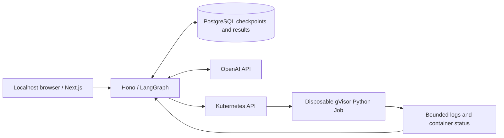

# Chat with contained Python execution

A local chat application lets an OpenAI model call `code_executor` to run Python in disposable, network-isolated gVisor Jobs. Conversations and execution results survive backend restarts in PostgreSQL. The browser shows assistant messages, tool progress, bounded output and execution status; you can create and switch independent threads or reload to recover their history.



Only the backend connects to OpenAI. Each Job receives generated source and fixed runner settings, with no conversation history or credentials. Python execution needs no callback or network connection.

## Supported host and prerequisites

The verified application path is **macOS ARM64 with Docker Desktop's Linux VM**, kind and Calico, running genuine gVisor Sentry with systrap and `network=none`. Linux x86_64 Ubuntu VM testing established runtime feasibility only: sustained full application execution there is unverified. Software-emulated x86_64 is not a tested application path.

Install these tools and make them available on `PATH`:

| Tool | Version or requirement |
| --- | --- |
| Node.js / npm | Node 22; container builds pin 22.23.2 |
| Docker | Docker Desktop with a running ARM64 Linux daemon and the `desktop-linux` context |
| kind | v0.32.0 |
| kubectl | v1.33.1, matching the cluster |
| Helm | Helm CLI supporting the included charts |
| Python / uv | Python 3.12 and uv for the runner build and checks |
| Shell tools | Bash, jq, curl, bzip2, sha256sum, OpenSSL |

On Homebrew macOS, use the versioned Node installation if your default Node is newer:

```sh
export PATH="/opt/homebrew/opt/node@22/bin:$PATH"
node --version
docker --context desktop-linux info --format '{{.OSType}} {{.Architecture}}'
```

Bootstrap downloads checksummed gVisor `release-20260907.0` artifacts and Calico `v3.31.3`, and creates a kind Kubernetes `v1.33.1` node. Platform-specific image digests/checksums live in [runtime/platform.sh](runtime/platform.sh), [runtime/kind.yaml](runtime/kind.yaml) and the runtime checksum files. Python uses `3.12.12-slim-bookworm`; backend/frontend Node bases and PostgreSQL `17.9-bookworm` are digest-pinned in their Dockerfiles and chart values. npm lockfiles and the runner's hash-locked dependencies are committed. Bootstrap builds each specific app directory, imports its actual manifest digest and deploys digest-addressed images with local loading; [state images.json](#bootstrap-and-keyless-verification) records the built references.

This downloads container layers, dependencies and Chromium and runs a Kubernetes node, PostgreSQL and two application services inside Docker Desktop. Allow memory and disk headroom for builds and probes. A reproducible minimum Docker memory allocation and total disk footprint have not been measured; there is no measured sizing claim. Kubernetes 1.33.1 was used for compatibility verification; current security maintenance of that version has not been assessed.

## Bootstrap and keyless verification

From a clean clone, change into `labs/lab-gvisor-ai-code-execution`. Run the following in Bash. Select a unique lab cluster name beginning with `gvisor-ai-code-execution-` and an absolute state directory **outside the checkout**. The commands below generate both:

```sh
export GVISOR_DOCKER_CONTEXT=desktop-linux
export DOCKER_CONTEXT="$GVISOR_DOCKER_CONTEXT"
export GVISOR_CLUSTER_NAME="gvisor-ai-code-execution-$(date +%s)-$$"
export GVISOR_STATE_DIR="$(mktemp -d /tmp/gvisor-ai-code-execution.XXXXXX)"
export GVISOR_KUBECONFIG="$GVISOR_STATE_DIR/cache/kubeconfig"
npm run bootstrap -- --scripted
npm run e2e
npm run connect
```

Bootstrap refuses an existing named cluster, verifies runtime identity and fail-closed/network controls, builds the runner/backend/frontend, installs fixed executor admission and deploys the application/database with Helm. It generates database credentials into a Kubernetes Secret. It does not edit your global kubeconfig or switch your global context. Keep these environment variables for all subsequent commands. The default cluster name, if omitted, is `gvisor-code-execution`; the explicit unique name above avoids reusing another instance.

`--scripted` substitutes **only model responses**. Hono, LangGraph, PostgreSQL persistence, Kubernetes, gVisor execution and Chromium browser tests remain real. It is a deterministic verification/demo mode, not general OpenAI chat: after e2e it returns to scripted calculation mode.

E2e owns localhost ports 3000/3001, temporarily configures scripted scenarios, exercises persistence and browser restart recovery, malicious source, resource bounds, admission, runtime identity and matched network positive controls, then restores scripted calculation mode. Stop `connect` before running e2e again. A required unavailable route exits nonzero and is marked unverified. The report and diagnostics are under `$GVISOR_STATE_DIR/verification`; image references are in `$GVISOR_STATE_DIR/images.json`. Reports can contain test source, nonce packets, Pod metadata and local paths: review them before sharing.

The keyless verification covers the real graph and execution stack. **Live OpenAI provider verification was NOT RUN by explicit owner waiver because no key was available.** It remains the owner-run check below.

## Use the application

Open <http://127.0.0.1:3000> while `npm run connect` runs. Create a thread, send a calculation request and inspect the tool result. Switch threads to keep conversations separate; reload to restore stored history. The scripted demo calculates `6 * 7` rather than interpreting arbitrary requests. Ctrl-C stops only the two localhost port forwards, leaving the cluster and database running.

The application is unauthenticated, local, single-owner software. Server-owned thread IDs and Origin checks do not supply production multi-user authorization. Anyone with local access to these services can act as the owner. Keep services and forwards on localhost.

Every manual Kubernetes command must use the owned kubeconfig **and** kind context, for example:

```sh
kubectl --kubeconfig "$GVISOR_KUBECONFIG" \
  --context "kind-$GVISOR_CLUSTER_NAME" -n executor-app get deployments
kubectl --kubeconfig "$GVISOR_KUBECONFIG" \
  --context "kind-$GVISOR_CLUSTER_NAME" -n executor get jobs,pods
```

The deployed backend uses its narrow in-cluster service account. These examples do not depend on your global current context or another local cluster.

## OpenAI mode and guarded smoke check

OpenAI mode is the bootstrap default. `openaiModel` defaults to `gpt-4.1-mini` in [charts/app/values.yaml](charts/app/values.yaml); edit that non-secret setting before bootstrap to choose another compatible model. The model name is configurable, not an immutable provider revision.

Create a **new** cluster and state directory for OpenAI mode. Supply `OPENAI_API_KEY` to the bootstrap process through your secret manager, or use the Bash hidden prompt below. Do not paste a key into a command, enable shell tracing, write it into the checkout or send it to the browser. These are owner-run instructions; verification does not request or read a key.

```sh
# Run in Bash, with tracing disabled. Enter the key only at the hidden prompt.
set +x
export GVISOR_DOCKER_CONTEXT=desktop-linux
export DOCKER_CONTEXT="$GVISOR_DOCKER_CONTEXT"
export GVISOR_CLUSTER_NAME="gvisor-ai-code-execution-$(date +%s)-$$"
export GVISOR_STATE_DIR="$(mktemp -d /tmp/gvisor-ai-code-execution.XXXXXX)"
export GVISOR_KUBECONFIG="$GVISOR_STATE_DIR/cache/kubeconfig"
read -r -s -p 'OpenAI API key: ' OPENAI_API_KEY
printf '\n'
export OPENAI_API_KEY
npm run bootstrap
unset OPENAI_API_KEY
npm run connect
```

Bootstrap sends the key through stdin into the backend-only `chat-openai` Kubernetes Secret, never through a command argument or generated repository file, and unsets it inside the bootstrap process. The caller must also unset its own environment as above. The frontend, execution Jobs and persisted conversations do not receive it. The trusted Kubernetes administrator and Docker host can access backend secrets.

With `connect` still running, run this in a second terminal from the same lab directory, restoring the same cluster/state/kubeconfig variables:

```sh
npm run smoke:openai
```

The guard refuses a scripted deployment. The smoke requests a real provider-selected `code_executor` call, requires successful Python output `42` and a completed turn, and prints only a bounded summary. OpenAI calls incur provider usage charges, including model/tool follow-up messages and conversation context; there is no measured cost estimate or fixed API price here. Use your provider account's current pricing and usage controls. Keyless e2e itself makes no provider calls and restores scripted mode, so it does not leave an OpenAI deployment ready for this smoke.

## Execution boundary and limits

The trusted boundary includes the backend, PostgreSQL, Kubernetes administrator/API, Docker host, gVisor runtime and Calico. Runtime checks inspect a live checksum-matched Sentry, not just `runtimeClassName`. Removing the handler must fail closed with **no runc fallback**. Network probes use independent positive controls and policy/runtime evidence, not timeout-only claims. Default-deny ingress/egress includes DNS; the verified handler additionally disables networking. IPv4 cluster configuration alone does not prove IPv6 or loopback denial. Metadata/external-address probes use disposable controlled listeners inside the owned node, not real cloud metadata services. These probes are not tests of unknown runtime escapes, kernel exploits or side channels.

Admission fixes the source-only Job/Pod specification: pinned image and command, non-root UID, read-only root, no privilege escalation, dropped capabilities, no service-account token, Secret/PVC/hostPath mounts, host namespaces, extra containers or runtime overrides. The backend can create/read/delete Jobs and read Pod status/logs; it cannot create arbitrary Pods, read Secrets or patch execution specifications. Namespace quota and durable backend reservations cap execution.

| Bound | Configuration |
| --- | --- |
| Source | 16 KiB UTF-8 |
| Execution watchdog / external Job deadline | 10 seconds / 20 seconds, no retries |
| CPU / memory | 500m / 128 MiB |
| Ephemeral storage / `/work` memory volume | 32 MiB declaration / 16 MiB tmpfs |
| Guest process/thread limit | inherited hard `RLIMIT_NPROC=32` |
| Node Pod PID setting | 128 host tasks; not proof of the guest bound |
| stdout / stderr | 8 KiB each, independent raw and UTF-8 text clamps |
| Aggregate log retrieval/parser budget | 32 KiB across polls, retries and restarts |
| Kubelet log retention | 1 MiB rotation, two files; periodic, not an instantaneous storage quota |
| Execution Jobs / active turns | 2 globally / 4 globally |
| Per thread / per turn | 1 active turn / 2 tool calls |
| Model call / total turn deadline | 120 seconds / 300 seconds |

Resource limits reduce damage and contention; they do not eliminate denial of service. Source and the same-UID runner/supervisor are one untrusted unit. Process limits and supervisor hardening are defense in depth; source can stop or kill the supervisor. Kubernetes deadline/OOM/container observations supply trusted status. Source-selected exit codes 124/137 or printed success/timeout fields cannot establish a trusted timeout/OOM result.

Captured output consists of bounded JSON/base64 data frames. Frame contents, attribution, final capture fields and runner-reported truncation are untrusted advisories. The backend independently clamps and budgets retrieval, retains complete partial diagnostics before damaged frames, and treats missing final capture on an otherwise successful container as capture failure. Externally observed deadline/OOM/nonzero status remains authoritative. Tool text is displayed as text and cannot choose a different Job policy.

## Persistence, recovery and teardown

PostgreSQL's LangGraph saver stores per-thread conversation checkpoints. Durable canonical model actions preserve tool IDs across restart gaps; stable thread/turn/tool IDs cache terminal execution results before deleting Jobs. Nonblocking per-thread ownership and global turn/execution reservations reject contention rather than queueing lock waits. Reconnection replays persisted events without blindly resubmitting source.

An execution whose possibly-started Job disappears is conservatively indeterminate: it is not rerun. Its slot can remain quarantined until the old execution is confirmed stopped. This favors avoiding duplicate execution over availability; a fresh lab reset may be required if ownership cannot be established. PostgreSQL keepalive settings help release ownership after a dead backend connection, but a paused process with a responding TCP kernel retains its lock. Crash verification proves the old container/PID stopped; it does not cover every network partition or promise lease-based takeover.

Stop `connect` with Ctrl-C, retain the same environment and run:

```sh
npm run teardown
```

Teardown checks the named node's kind ownership label and deletes only that lab cluster. It never prunes Docker or deletes unrelated clusters. State, evidence and the owned kubeconfig remain in your chosen directory; cluster deletion removes the deployed database and Secrets. Remove the state directory after reviewing it if you no longer need those files. A reset means teardown followed by bootstrap with a new unique cluster/state pair; it does not preserve conversations. See [scripts/README.md](scripts/README.md) for script details.
