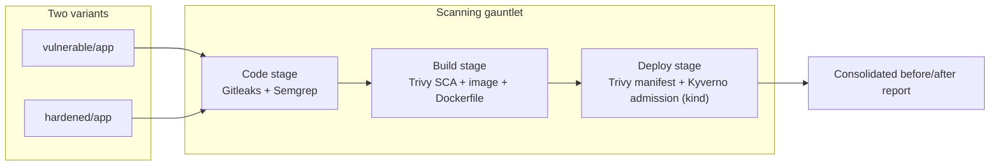

# Catch it before prod: an OSS scanning gauntlet for Kubernetes apps

This lab takes the same deliberately vulnerable app as its companion exploit
lab and catches every one of its flaws *before* any of it ever runs — with
layered open-source scanners across the code, build, and deploy stages, then
proves a hardened variant comes back clean and gets admitted to the cluster.
One command runs the whole gauntlet:

```bash
./run.sh
```

## Companion lab

This is the defensive sequel to **[Break a vulnerable app on Kubernetes: recon to RCE](../lab-k8s-appsec-exploit/)**, where the *same* app is attacked live — SQL injection to stolen PII, a leaked hardcoded key, command-injection RCE, and a one-request crash. Read that lab to see the four bugs exploited; read this one to catch them before they ship. Its companion post: [Break a Vulnerable App on Kubernetes: Recon to RCE With OSS Tools](https://utr1903.github.io/tech-with-ugur-blog/posts/k8s-appsec-exploit/).

## Safety

The `vulnerable/` app is intentionally insecure — every vulnerable line is
the same kind of flaw exploited in the companion lab, including an
obviously-fake, canary API key (`sk-vuln-lab-DO-NOT-USE-0000-canary`) and no
real customer data anywhere. Everything here runs locally against throwaway
scan targets and a throwaway `kind` cluster; nothing is deployed anywhere
reachable by anyone else.

## What you build

Two variants of the same app — `vulnerable/` and `hardened/` — pushed
through the same three scanning stages, then consolidated into one
before/after report.



Tear it down and there's nothing left outside this folder's `tmp/`
directory.

## Prerequisites

Tested on macOS with Docker Desktop. Install everything else with:

```bash
brew install trivy semgrep gitleaks kind kubectl jq
```

`node` and `npm` are also required. Run
`./scripts/check-prereqs.sh` at any time to confirm the host has everything
installed.

The static scans (Gitleaks, Semgrep, Trivy's bundled misconfig policies) run
fully offline against custom, lab-authored rules. Two steps do need the
network: Trivy downloads its vulnerability database on first run, and the
admission stage pulls Kyverno's install manifest into `kind`.

Tested-with versions:

| Tool | Version |
| --- | --- |
| Docker | 28.3.2 |
| kind | 0.32.0 (node image `kindest/node:v1.35.0`) |
| kubectl | 1.36.x |
| Trivy | 0.71.1 |
| Semgrep | 1.165.0 |
| Gitleaks | 8.30.1 |
| jq | 1.8.2 |
| Node (app base image) | 22.23.2-alpine |
| Kyverno | v1.18.2 |

## Run it

```bash
./run.sh            # the full gauntlet: scan, admission, consolidated report
./run.sh scan        # static scans of both apps (code + build + deploy) — no cluster
./run.sh admission   # spin up kind + Kyverno, test deny/admit, tear down
./run.sh report      # print the consolidated table from the last run
./run.sh e2e         # non-interactive: asserts every finding id, prints E2E PASSED
./run.sh down        # delete the kind cluster and remove tmp/
```

`./run.sh scan` scans both `vulnerable/` and `hardened/` across all three
static stages and writes each tool's raw JSON output under `tmp/<variant>/`.
`./run.sh admission` is the only stage that touches a cluster: it creates a
`kind` cluster, installs Kyverno, applies the policy, and checks that the
vulnerable Deployment is denied while the hardened one is admitted.
`./run.sh e2e` runs everything back to back and asserts, id by id, that
every finding in `expected/findings.json` shows up on the vulnerable app and
is absent on the hardened one.

## The code stage

```bash
./scripts/scan-code.sh vulnerable
```

**Gitleaks** scans `vulnerable/app` against a lab-authored rule
(`scanners/gitleaks/.gitleaks.toml`) and finds the hardcoded key committed in
`src/config.ts`:

```
vuln-lab-hardcoded-api-key   sk-vuln-lab-DO-NOT-USE-0000-canary   src/config.ts
```

**Semgrep** scans the same source against lab-authored rules
(`scanners/semgrep/rules.yaml`) and flags two sinks: the interpolated SQL in
`src/db/customers.ts` (`vuln-lab-sqli`) and the shell command built by string
interpolation in `src/system/lookup.ts` (`vuln-lab-command-injection`).

This is the earliest possible catch — before an image is even built, both
the secret and the two injection sinks are visible in the diff.

## The build stage

```bash
./scripts/scan-build.sh vulnerable
```

**Trivy's SCA scan** (`trivy fs`) reads `package.json`/`package-lock.json`
and reports the outdated `lodash@4.17.20` dependency as `CVE-2021-23337`.
**Trivy's image scan** (`trivy image`), run against the image this script
just built, reports the same CVE — proving the vulnerable package is baked
into the shipped layers, not just declared in a manifest nobody installs
from. **Trivy's Dockerfile scan** (`trivy config`) flags `vulnerable/app/Dockerfile`
for running as root (`DS-0002`) — there's no `USER` directive, so the
container runs as `root` by default.

A dependency scan alone only proves the vulnerable version is declared;
the image scan is what proves it actually shipped.

## The deploy stage

```bash
./scripts/scan-deploy.sh vulnerable
./scripts/admission.sh all
```

**Trivy's manifest scan** (`trivy config` against
`vulnerable/k8s/deployment.yaml`) flags the missing hardening before the
manifest is ever applied: no `runAsNonRoot` (`KSV-0012`), no
`readOnlyRootFilesystem` (`KSV-0014`), and no CPU limit (`KSV-0011`) — the
manifest sets a memory limit but nothing else.

**Kyverno**, installed into a throwaway `kind` cluster and enforcing the
policy in `policy/kyverno/require-hardened.yaml`, then goes one step
further than a static scan: it actually **refuses to admit** the vulnerable
Deployment (the `require-run-as-non-root` rule denies it) and **admits** the
hardened one.

Why layers win: no single scanner catches everything. Gitleaks only knows
secrets; Semgrep only knows source patterns; Trivy's SCA scan only knows
declared dependencies; its image scan only knows what's actually in a
layer; its manifest scan only knows what's missing from YAML before it's
applied; Kyverno is the only one of the six that can actually stop a bad
workload from ever starting. Each stage is the earliest point in the
pipeline where its class of bug can be caught — and each one catches
something none of the others would.

## The fixes

| Finding | Fix in `hardened/` |
| --- | --- |
| SQL injection (`vuln-lab-sqli`) | `buildSearchSql` in `src/db/customers.ts` uses a `$1` placeholder and passes `q` as a bound parameter instead of interpolating it into the query text. |
| Hardcoded secret (`vuln-lab-hardcoded-api-key`) | `src/config.ts` reads the key from `INTERNAL_API_KEY` at runtime instead of embedding it in source; the debug endpoint that dumped it (`/api/debug/config`) is removed from `src/server/routes.ts` entirely. |
| Command injection (`vuln-lab-command-injection`) | `src/system/lookup.ts` validates `host` against an allowlist regex, then calls `execFile("ping", [...])` with an argument array — never a shell — so no metacharacter can be interpreted. |
| Outdated dependency (`CVE-2021-23337`) | `lodash` is bumped from `4.17.20` to the patched `4.17.21` in `package.json`. |
| Root container (`DS-0002`) | `hardened/app/Dockerfile` adds a multi-stage build and a `USER node` before `CMD`, plus a `HEALTHCHECK`. |
| Missing manifest hardening (`KSV-0012`, `KSV-0014`, `KSV-0011`) | `hardened/k8s/deployment.yaml` sets pod-level `runAsNonRoot`/`runAsUser`/`seccompProfile`, container-level `readOnlyRootFilesystem`/`allowPrivilegeEscalation: false`/dropped capabilities, CPU+memory requests and limits, and both a `readinessProbe` and a `livenessProbe`. |

## Teardown

```bash
./run.sh down
```

Deletes the `kind` cluster and removes this lab's `tmp/` directory (already
gitignored).
